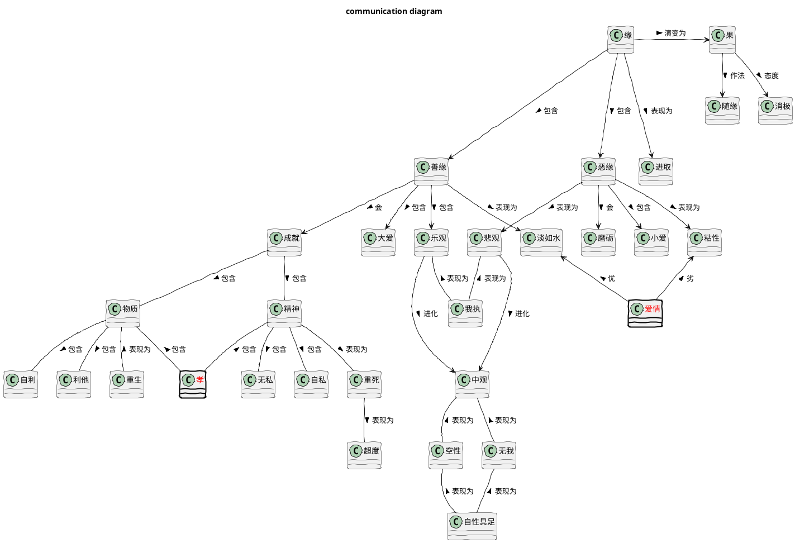

```plantuml
@startuml
title "communication diagram"
skinparam handwritten true
class 缘
缘 ---> 进取 : > 表现为
缘 --right---> 果 : > 演变为
缘 ---> 善缘 : > 包含
缘 ---> 恶缘 : > 包含
善缘 --> 成就 : > 会
善缘 --> 大爱 : > 包含
善缘 --> 乐观 : > 包含
恶缘 --> 磨砺 : > 会
恶缘 --> 小爱 : > 包含
恶缘 --> 悲观 : > 表现为
悲观 -- 我执 : < 表现为
乐观 -- 我执 : < 表现为
悲观 ---> 中观 : 进化 >
乐观 ---> 中观 : 进化 >
中观 -- 空性 : < 表现为
中观 -- 无我 : < 表现为
空性 -- 自性具足 : < 表现为
无我 -- 自性具足 : < 表现为
善缘 --> 淡如水 : > 表现为
恶缘 --> 粘性 : > 表现为
class 爱情 #line.bold;line:black;text:red; {}
淡如水 <-- 爱情 : < 优
粘性 <-- 爱情 : < 劣
成就 -- 物质 : > 包含
成就 -- 精神 : > 包含
物质 -right- 孝 :  < 包含
class 孝 #line.bold;line:black;text:red; {}
精神 -- 孝 : < 包含
精神 -- 重死 : > 表现为
精神 -- 无私 : > 包含
精神 -- 自私 : > 包含
重死 -- 超度 : > 表现为
物质 -- 重生 : < 表现为
物质 -- 自利 : > 包含
物质 -- 利他 : > 包含
果 --> 随缘 : > 作法
果 --> 消极 : > 态度
@enduml
```

