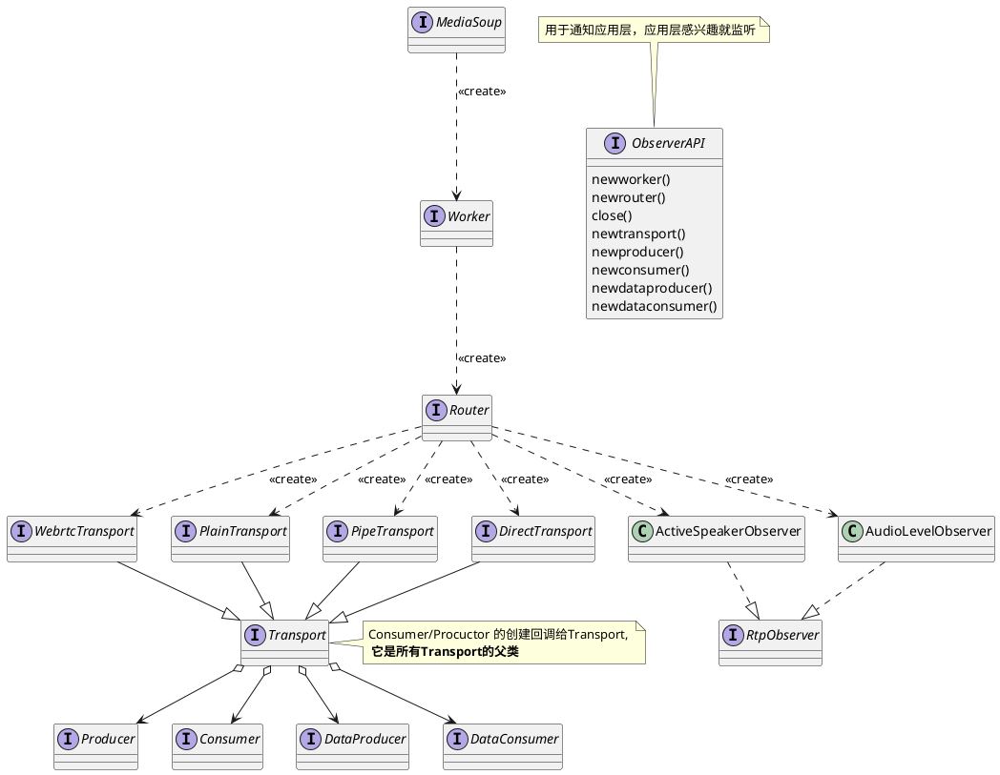

# 前提
1. mediaSoup 分 C、S两端。  
1. 是SFU，只管选择-转发
1. 是库，C、S两端口都需要自己开发。

## 架构图

如图所示， 推流端是“生产者”(webrtc的流也可以是rtp的流)， 拉流(录制)端是消费者，通过路由(router)连接。

## API类图

```plantuml
@startuml
title ""
@enduml
```
## 核心


