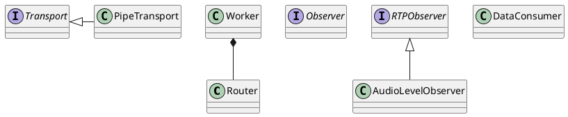

# 思考
mediaSoup 分 C、S两端。  
它是个SFU，只管选择-转发

## 架构图

## API类图

```plantuml
@startuml
class Router {

}

class Worker {

}

interface Transport {

}
class PipeTransport {

}


interface Observer {

}

interface RTPObserver {

}

class DataConsumer {

}

Transport <|- PipeTransport
RTPObserver <|-- AudioLevelObserver 
Worker *-- Router

@enduml
```
## 核心

```plantuml
@startuml

class A {

}

@enduml
```