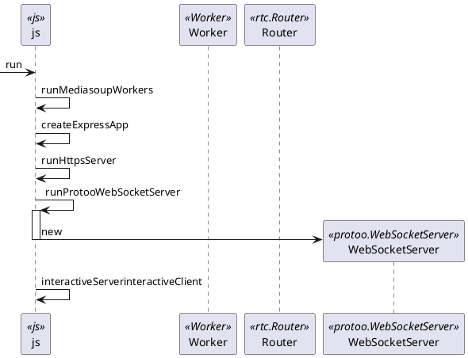
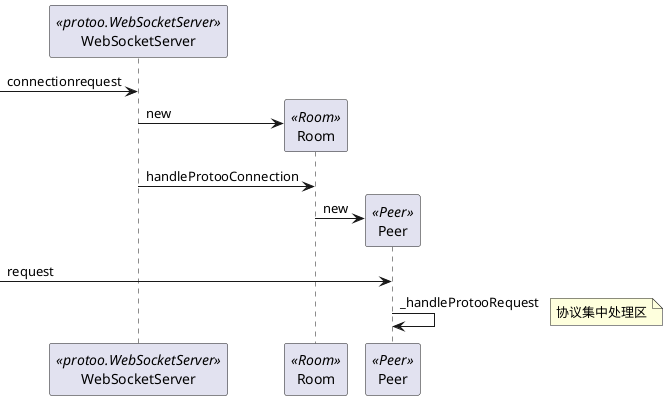
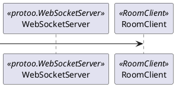

# server
1. js 与 c++ 通信 
### proto.server/proto.client
1. req/res/notify
1. c-s

```plantuml
@startuml
title ""
class RoomClient
@enduml
```

```plantuml
@startuml
title ""
participant js as js <<js>>
participant Worker as worker <<Worker>>
participant Router as router <<rtc.Router>>
participant WebSocketServer as wss <<protoo.WebSocketServer>>
-> js: run
js -> js : runMediasoupWorkers
js -> js : createExpressApp
js -> js : runHttpsServer
js -> js : runProtooWebSocketServer
activate js
create wss
js -> wss : new
deactivate  
js -> js : interactiveServerinteractiveClient
@enduml
``` 

```plantuml
@startuml
title ""
participant WebSocketServer as wss <<protoo.WebSocketServer>>
participant Room as room <<Room>>
participant Peer as peer <<Peer>>

-> wss : connectionrequest
create room
wss -> room :new 
wss -> room : handleProtooConnection
create peer
room -> peer : new
-> peer : request
peer -> peer : _handleProtooRequest
note right: 协议集中处理区
@enduml
```  
# client

```plantuml
@startuml
title ""
participant WebSocketServer as wss <<protoo.WebSocketServer>>
participant RoomClient as roomc <<RoomClient>>
-> roomc : 
@enduml
``` 
```plantuml
@startuml
title ""
@enduml
``` 
```plantuml
@startuml
title ""
@enduml
``` 