# worker 实现
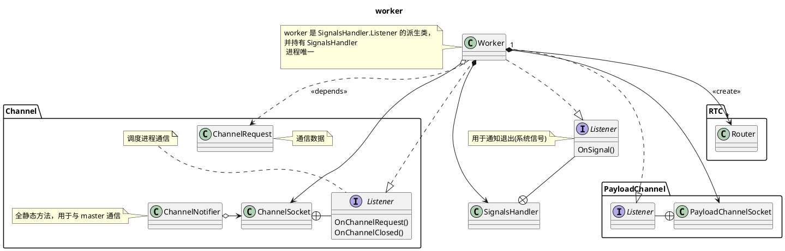
worker 是起点。代表一个进程。通过 channel 与外部通信，使用 router 完成内部功能.  
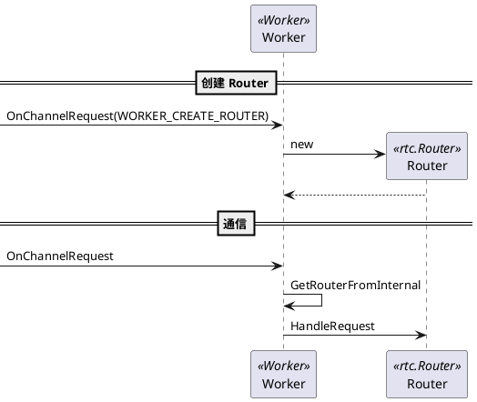
由上可知， worker 的通信入口就是 OnChannelRequest 方法。
router 的通信入口就是 HandleRequest。
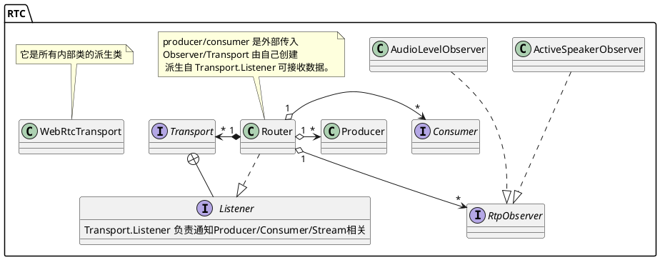
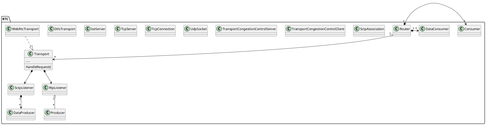
从 router 看起， 它持有 Transport,而Transport继承自N多 Listener; 它的子类 webrtcTransport 更甚，继承自更多 Listener. 可见Transport及其子类是信息处理中心。  
TcpServer.Listener/IceServer.Listener/DtlsTransport.Listener 用于状态监听；  
TcpConnection.Listener/UdpSocket.Listener 用于数据接收。  
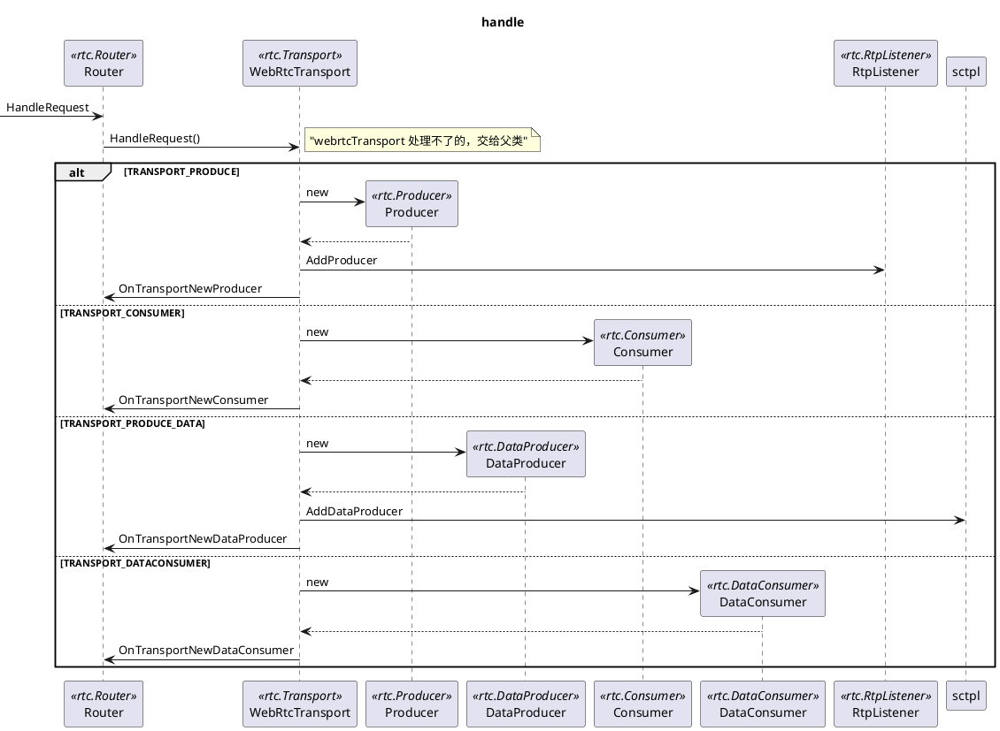
由图可知，各类型对象最终汇总到了Router里。因此Router可以根据需要把数据交给指定对象处理。  
Router 的数据输入有两类，一类是由 HandlerRequest 主动调用，一种是由底层各种回调上来的。

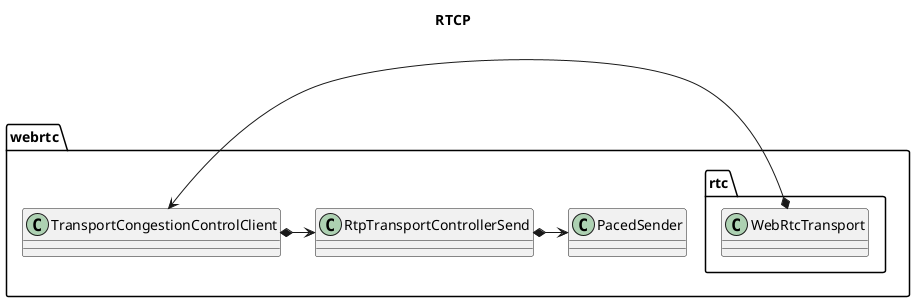
上图主要表示RTCP相关的类。
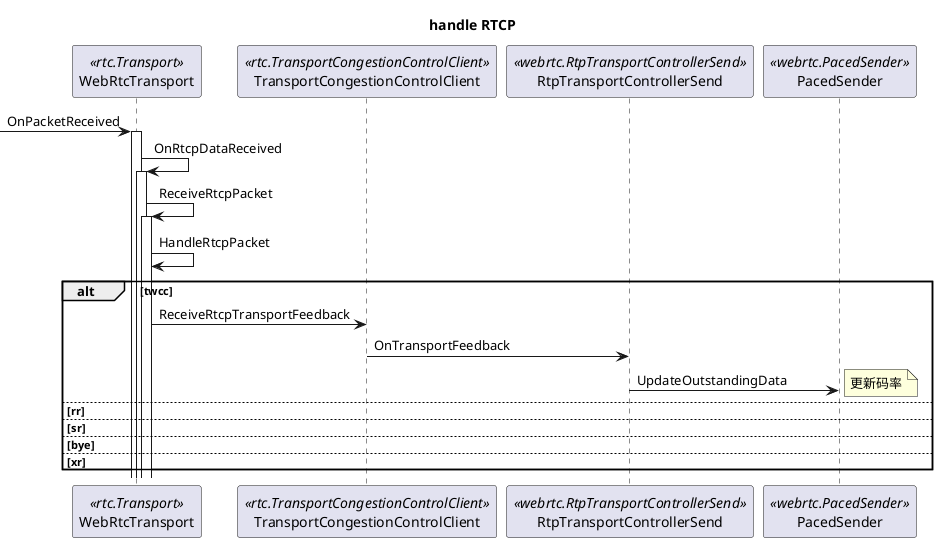

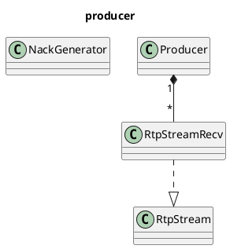
从 producer 看起，一个producer 属于一个连接， 一个 producer 拥有多个 RtpStreamRecv 。  
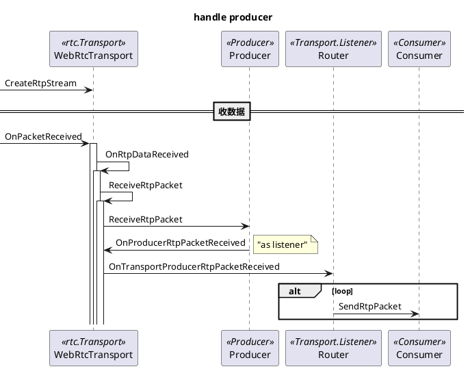
先收到 WebrtcTransPort 中， 再回调到 router里，最终在 router 里实现数据分发。  
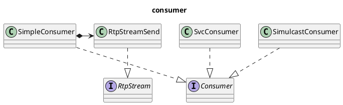
RtpStreamSend 的 Listener 是派生自己 RtpStream 的。这点要注意一下。
Consumer 共三类，分别处理不同的逻辑。  
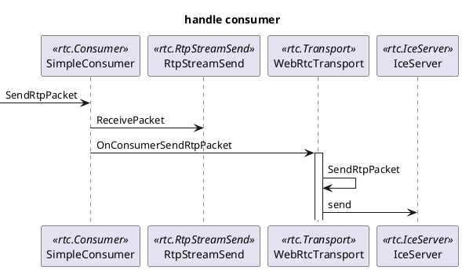
到了 iceServer 可以认为进入了网络层。