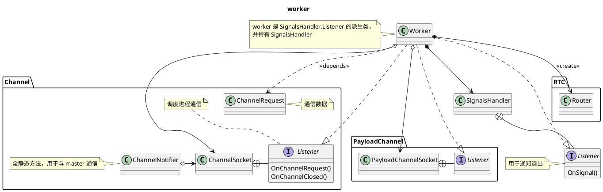
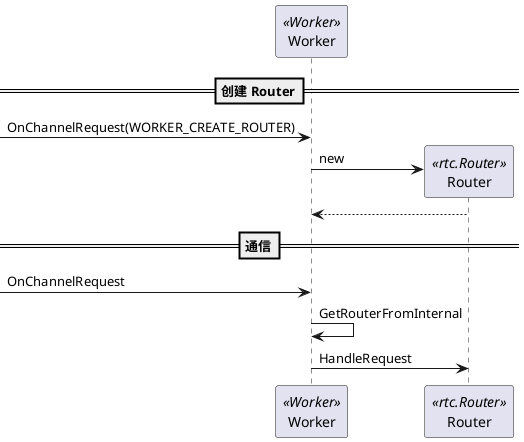
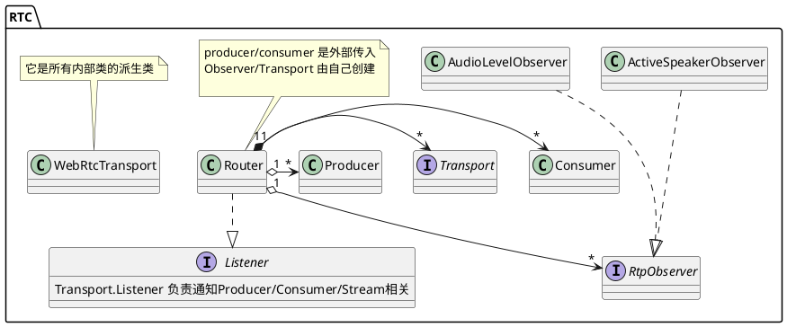
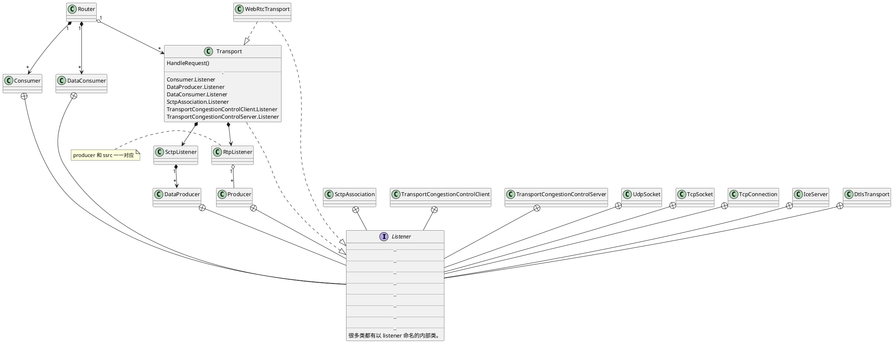
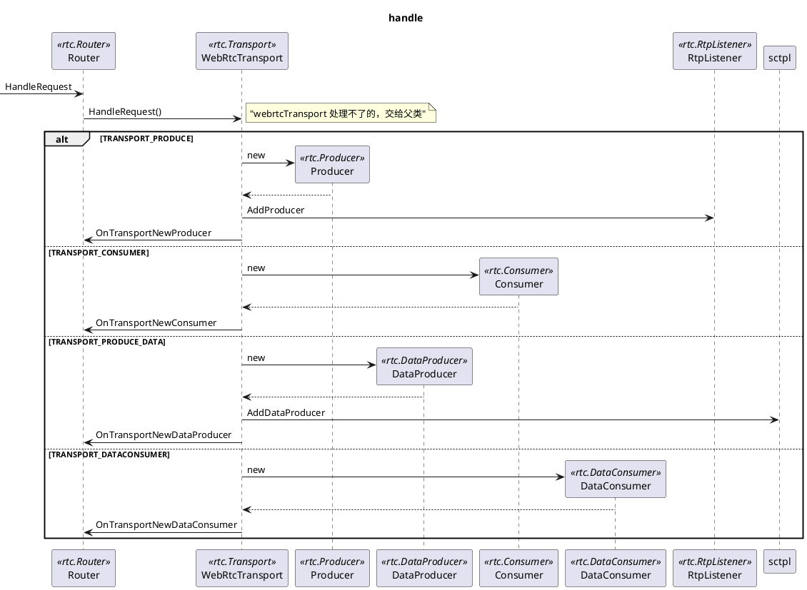

```plantuml
@startuml
title "worker"
namespace Channel {
    interface Listener {
        OnChannelRequest()
        OnChannelClosed()
    }
    class ChannelRequest
    ChannelSocket +- Listener
    ChannelNotifier o-> ChannelSocket
    note "全静态方法，用于与 master 通信" as N1
    N1 . ChannelNotifier
    note "调度进程通信" as N2
    N2 .. Listener
    note "通信数据" as N3
    ChannelRequest . N3
}
namespace PayloadChannel {
    interface Listener{
        
    }
    PayloadChannelSocket +- Listener
}
namespace RTC {
    class Router
}
interface Listener {
    OnSignal()
}
SignalsHandler +- Listener

Worker ...|> Listener
Worker ...|> PayloadChannel.Listener
Worker ...|> Channel.Listener
Worker ..> Channel.ChannelRequest : <<depends>>
Worker *--> RTC.Router : <<create>>
Worker *--> SignalsHandler
Worker o--> Channel.ChannelSocket
Worker o-> PayloadChannel.PayloadChannelSocket
note "worker 是 SignalsHandler.Listener 的派生类，\n并持有 SignalsHandler \n" as N1
N1 . Worker
note "用于通知退出" as N2
N2 . Listener 
@enduml
```

```plantuml
@startuml
title ""
participant Worker as worker <<Worker>>
participant Router as router <<rtc.Router>>
==创建 Router==
-> worker: OnChannelRequest(WORKER_CREATE_ROUTER)
create router
worker -> router : new
return
==通信==
-> worker: OnChannelRequest
worker -> worker : GetRouterFromInternal
worker -> router : HandleRequest
@enduml
```
由上可知， worker 的通信入口就是 OnChannelRequest 方法。
router 的通信入口就是 HandleRequest。

```plantuml
@startuml
namespace RTC {
    interface RtpObserver
    interface Transport
    interface Listener {
        Transport.Listener 负责通知Producer/Consumer/Stream相关
    }
    ActiveSpeakerObserver ...|> RtpObserver
    AudioLevelObserver ...|> RtpObserver


    Router ..|> Listener
    Router "1" *-> "*" Transport
    Router "1" o-> "*" Producer
    Router "1" o-> "*" Consumer
    Router "1" o--> "*" RtpObserver
    note "producer/consumer 是外部传入\nObserver/Transport 由自己创建\n " as N1 
    N1 .. Router
    note "它是所有内部类的派生类" as N2
    N2 .. WebRtcTransport
}
@enduml
```

```plantuml
@startuml
interface Listener {
    ......
    ......
    ......
    ......
    ......
    ......
    ......
    ......
    很多类都有以 listener 命名的内部类。
}
class Transport {
    HandleRequest()
    .....
	Consumer.Listener
	DataProducer.Listener
	DataConsumer.Listener
	SctpAssociation.Listener
	TransportCongestionControlClient.Listener
	TransportCongestionControlServer.Listener    
}
    Router "1" o--> "*" Transport
    Router "1" *-> "*" Consumer
    Router "1" *-> "*" DataConsumer 

    Transport *--> SctpListener
    SctpListener "1" *--> "*" DataProducer
    Transport *--> RtpListener
    RtpListener "1" o-- "*" Producer
	Transport .|> Listener
	Consumer +-- Listener
	DataProducer +-- Listener
	DataConsumer +-- Listener
	SctpAssociation +-- Listener
	TransportCongestionControlClient +-- Listener
	TransportCongestionControlServer +-- Listener
    Producer +-- Listener
    UdpSocket +-- Listener
    TcpSocket +-- Listener
    TcpConnection +-- Listener
    IceServer +-- Listener
    DtlsTransport +-- Listener
    WebRtcTransport ..|> Transport
    WebRtcTransport ..|> Listener
    note "producer 和 ssrc 一一对应" as N1
    N1 . RtpListener
@enduml
```

```plantuml
@startuml
title " handle"
participant Router as router <<rtc.Router>>
participant WebRtcTransport as trans <<rtc.Transport>>
participant Producer as prod <<rtc.Producer>>
participant DataProducer as dprod <<rtc.DataProducer>>
participant Consumer as cons <<rtc.Consumer>>
participant DataConsumer as dcons <<rtc.DataConsumer>>

participant RtpListener as rtpl <<rtc.RtpListener>>

-> router: HandleRequest
router -> trans : HandleRequest()
note right: "webrtcTransport 处理不了的，交给父类"
alt TRANSPORT_PRODUCE
create prod
trans -> prod : new
return
trans -> rtpl : AddProducer
trans -> router : OnTransportNewProducer
else TRANSPORT_CONSUMER
create cons
trans -> cons : new
return 
trans -> router : OnTransportNewConsumer
else TRANSPORT_PRODUCE_DATA
create dprod
trans -> dprod : new
return
trans -> sctpl : AddDataProducer
trans -> router : OnTransportNewDataProducer
else TRANSPORT_DATACONSUMER
create dcons
trans -> dcons : new
return 
trans -> router : OnTransportNewDataConsumer
end
@enduml
```

