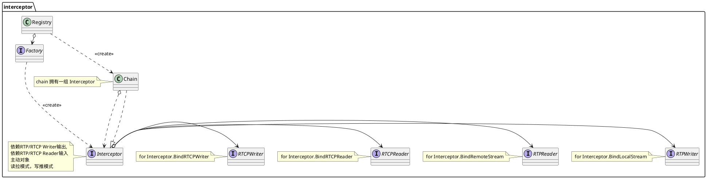
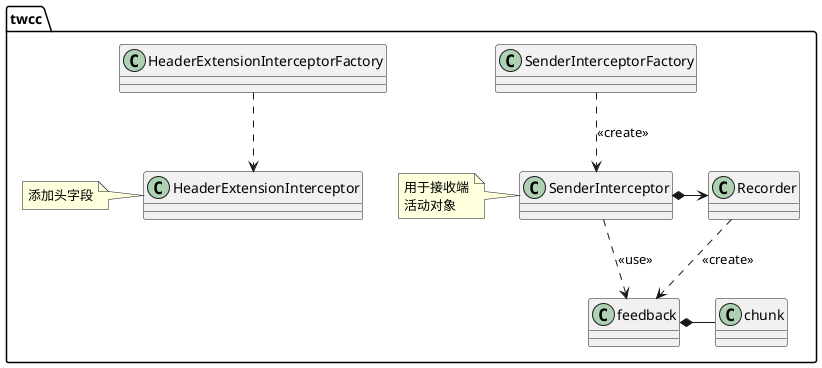
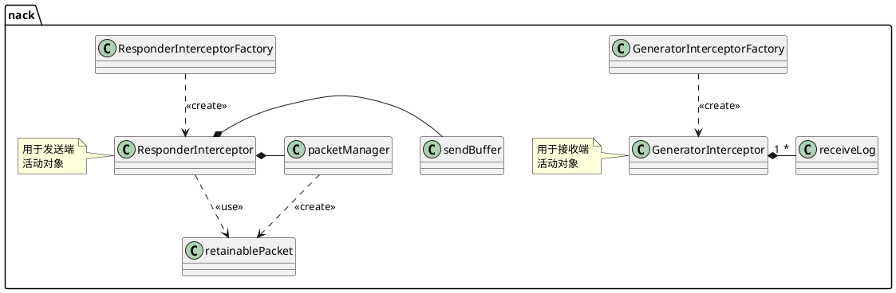

RTP/RTCP 相关性很强，需要统计RTP后通过RTCP发出去。所以要两个协议都处理。interceptor 是个巧妙的把这两者联系在了一起。  


### GCC

GCC 算法。该算法充分考虑了网络丢包和网络延迟对码率估计的不同影响，分别基于丢包率和网络延迟进行码率估计，最后综合得出最优值。  
算法实现上，基于丢包率的码率估计在发送端进行，基于网络延迟的码率估计在接收端进行。最后，在发送端计算出最优值，作用于Codec和PacedSender模块。GCC算法能够较好地基于网络实时状况估计网络带宽，为网络实时通信打下坚实基础。  
GCC算法弊端：不能适应所有网络模型、应对网络峰值能力差。比如实时在线编辑场景。  

```plantuml
package cc {
    interface BandwidthEstimator
    class NoOpPacer
    delayController ..> delayControllerConfig : <<depend>>
    delayController ..> rateCalculator
    delayController ..> rateController
    delayController ..> overuseDetector
    delayController ..> arrivalGroupAccumulator
    delayController ..> slopeEstimator : <<create>>
    delayController ..> rttEstimator : <<create>>

    slopeEstimator *--> kalman

    InterceptorFactory -> BandwidthEstimator
    

}
package gcc {
 class lossBasedBandwidthEstimator {}
}
@enduml
```
delayController rttEstimator  rateCalculator 都是活动对象。  
### TWCC

SenderInterceptor 统计 rtp 包，放入 recorder,由 recorder 生成 TWCC包，再由 SenderInterceptor 发出去。  
### NACK

GeneratorInterceptor 接收所有的输入RTP包，提取其序列号，然后放入 receiveLog中，再由 GeneratorInterceptor 周期性的发送 NACK 包。 
ResponderInterceptor 接收 NACK 包, 然后重发特定的包。  