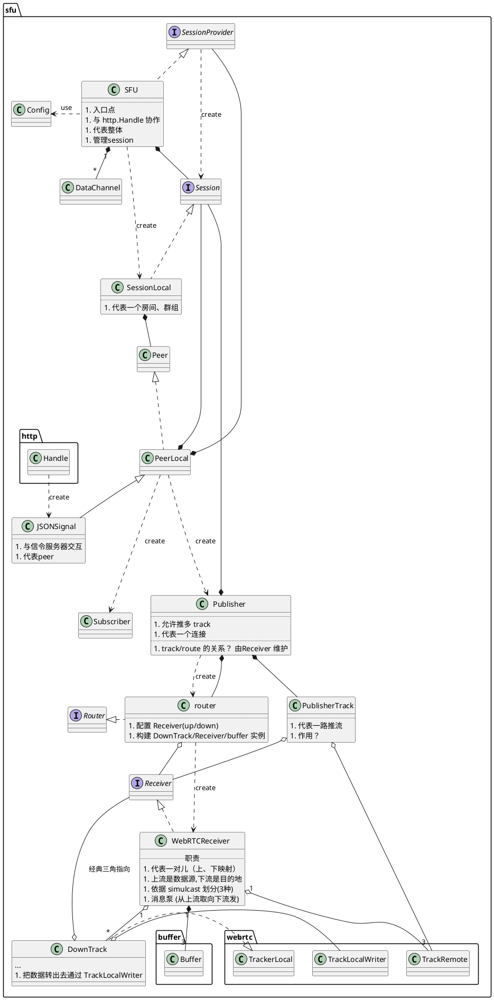

# sfu (Selective Forwarding Unit)

```plantuml
@startuml
namespace sfu {
    interface Receiver
    interface Router
    interface Session
    interface SessionProvider
    class JSONSignal {
        ....
        1. 与信令服务器交互
        1. 代表peer
    }
    class router {
        ....
        1. 配置 Receiver(up/down)
        1. 构建 DownTrack/Receiver/buffer 实例
    }
    class WebRTCReceiver {
        ..职责..
        1. 代表一对儿（上、下映射）
        1. 上流是数据源,下流是目的地
        1. 依据 simulcast 划分(3种)
        1. 消息泵 (从上流取向下流发)
    }
    class DownTrack {
        ...
        1. 把数据转出去通过 TrackLocalWriter
    }
    class Publisher {
        ....
        1. 允许推多 track
        1. 代表一个连接
        ....
        1. track/route 的关系？ 由Receiver 维护
    }
    class PublisherTrack {
        ....
        1. 代表一路推流
        1. 作用？
    }
    class SessionLocal {
        ....
        1. 代表一个房间、群组
    }
    class SFU {
        ....
        1. 入口点
        1. 与 http.Handle 协作
        1. 代表整体
        1. 管理session
    }
    SFU .left.|> SessionProvider 
    SFU .left.> Config : use
    SessionProvider ...> Session : create
    SFU ...> SessionLocal : create
    SFU *-- Session
    SFU "1" *-- "*" DataChannel
    Peer <|... PeerLocal
    PeerLocal <|-- JSONSignal
    PeerLocal ...> Subscriber : create
    PeerLocal ...> Publisher : create
    PeerLocal *-- SessionProvider
    PeerLocal *-- Session
    Publisher ..> router : create 
    Publisher *-- router
    Publisher *-- Session
    Publisher *-- PublisherTrack
    PublisherTrack o-- Receiver
    PublisherTrack o-- webrtc.TrackRemote
    router .left.|> Router
    router ...> WebRTCReceiver : create
    router o-- Receiver
    webrtc.TrackerLocal <|... DownTrack
    DownTrack o- webrtc.TrackLocalWriter
    DownTrack o-- Receiver : 经典三角指向
    WebRTCReceiver .up.|> Receiver
    WebRTCReceiver "1" o-- "3" webrtc.TrackRemote
    WebRTCReceiver "1"  o-- "*" DownTrack
    WebRTCReceiver "1" *-- "3" buffer.Buffer
    Session <|... SessionLocal
    SessionLocal *-- Peer
    http.Handle ..> JSONSignal : create
}
@enduml
```