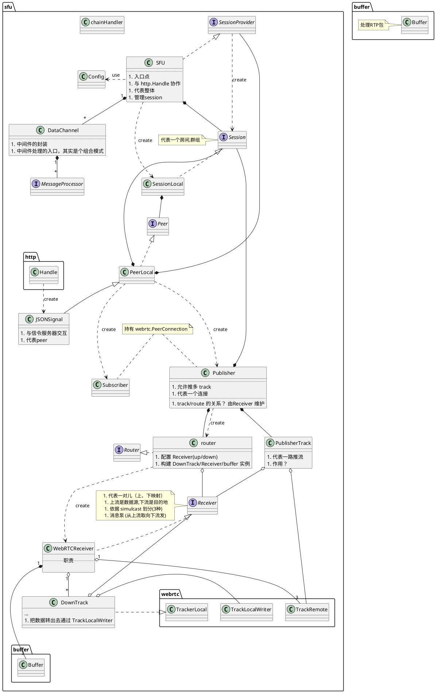

# sfu (Selective Forwarding Unit)

SFU 代表整个程序空间，管理与创建 Session ; Session 代表一个群组、房间、会议; Peer 代表一路连接（可能是推流也可能是拉流，也可能是推拉都有)。 Publisher 代表 Peer 的推流功能; Subscriber 则代表 Peer 的拉流功能。
Publisher 使用 router 把对应的数据广播到对应的 subscriber 中。