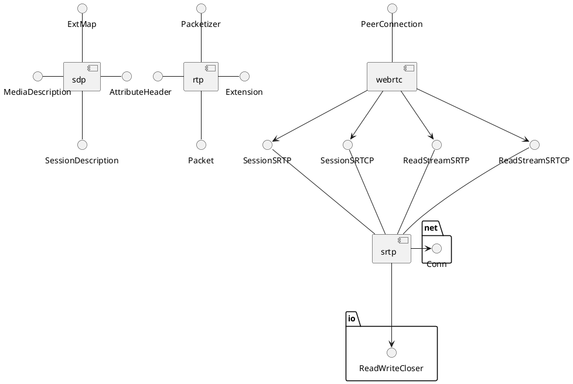

# webrtc
[标准文档](https://www.w3.org/TR/webrtc/)
## CRC

```plantuml
@startuml
package net {
    () Conn
}
package io {
    () ReadWriteCloser
}
[webrtc]  --> ReadStreamSRTCP
[webrtc]  --> ReadStreamSRTP
[webrtc]  --> SessionSRTCP
[webrtc]  --> SessionSRTP
[webrtc] -up- PeerConnection

[srtp] -right--> Conn
[srtp] ---> ReadWriteCloser
[srtp] -up-- ReadStreamSRTCP
[srtp] -up- ReadStreamSRTP
[srtp] -up-- SessionSRTCP
[srtp] -up- SessionSRTP

[rtp] -up- Packetizer
[rtp] -down- Packet
[rtp] -left- Header
[rtp] -right- Extension

[sdp] -up- ExtMap
[sdp] -down-  SessionDescription
[sdp] -left-  MediaDescription
[sdp] -right-  Attribute

@enduml
```