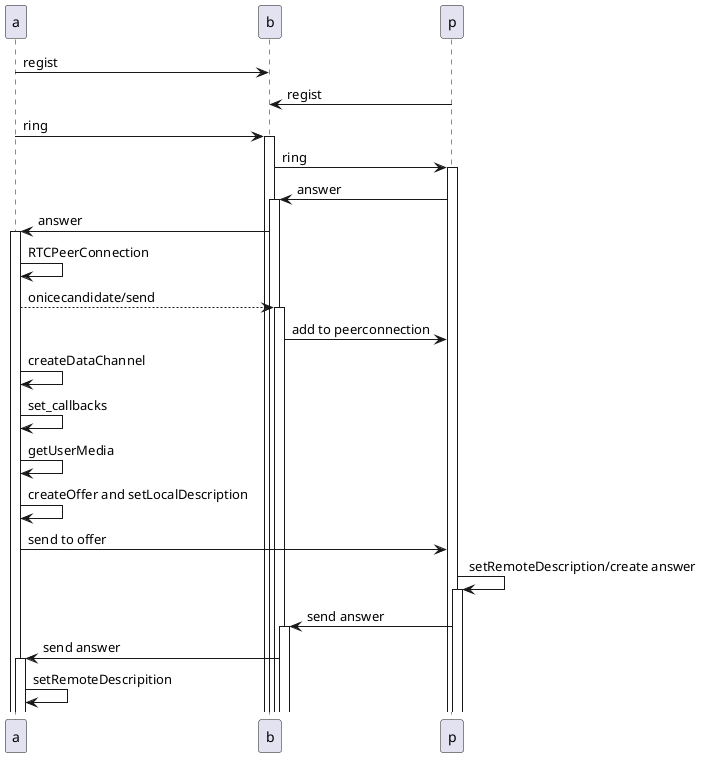

```plantuml
@startuml
participant a
participant b

participant p
a -> b : regist
p -> b : regist
a -> b : ring
activate b
b -> p :ring
activate p
p -> b : answer
activate b
b -> a : answer
activate a
a -> a : RTCPeerConnection
a --> b : onicecandidate/send 
activate b
b -> p : add to peerconnection
a -> a : createDataChannel
a -> a : set_callbacks
a -> a : getUserMedia
a -> a : createOffer and setLocalDescription
a -> p : send to offer
p -> p : setRemoteDescription/create answer
activate p
p -> b : send answer
activate b
b -> a : send answer
activate a
a -> a : setRemoteDescripition


@enduml
```