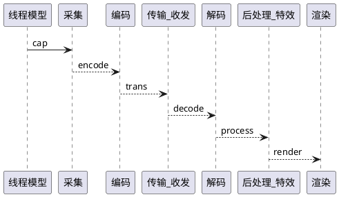
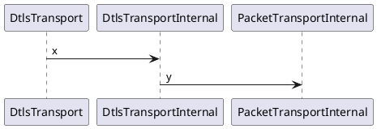

<!-- TOC -->

- [webrtc是什么？](#webrtc是什么)
- [基本组成](#基本组成)
    - [采集](#采集)
    - [传输](#传输)
        - [rtp/rtcp](#rtprtcp)
        - [[thread](.thread.md)](#threadthreadmd)
        - [ORTC](#ortc)
        - [dtls](#dtls)
        - [VideoChannel](#videochannel)
        - [video](#video)
        - [消息队列](#消息队列)
    - [编码](#编码)
    - [传输](#传输-1)
    - [解码](#解码)
    - [后处理（特效）](#后处理特效)
    - [渲染](#渲染)

<!-- /TOC -->

# webrtc是什么？
从功能来说，它是多媒体功能集。  
` 如果无名字空间限制,默认名字空间为:webrtc. `      
` XXInterface 表明这个功能部分的顶层类.`  
` XXFactory 表明这个功能部分的构造器`  
# 基本组成  

## 采集
## 传输
数据->rtp/rtcp混合->dtls->udp->发送  
### rtp/rtcp   
从 third_party 目录中发现了libsrtp库.从这里开始.  
cricket::SrtpSession封装了libsrtp.由它与其它类交互。
这种组件有两种使用方式。1，它连接下游，直接数据就流过去了；2，只处理结果丢出去。从SrtpTransport的数据成员看，应该是方法2.  
谁给它数据呢？看谁调用了ProtectRtcp.是SrtpTransport.    
DtlsSrtpTransport--派生自->SrtpTransport--派生自->RtpTransport--派生自->RtpTransportInternal--派生自->RtpTransportInterface.
它有回调函数OnRtpPacketReceived,推断是收到RTP包后会回调过来。经查，由RtpTransport::OnReadPacket调用。这也是个回调，数据被直接传来了。继续跟踪。  
这个函数重名太多。突然发现，它是私有方法。那只能在本类使用。进而发现，它是个solt,由RtpTransport::SetRt(c)pPacketTransport设置。go on..
rtc::PacketTransportInternal是信号源。从命名上看，已经属于不同的功能块了。  
能调用的三个地方
RtpTransportInternalAdapter
JsepTransportController
DtlsSrtpTransport::SetDtlsTransports
再找。我去死结了。  
### [thread](.thread.md)  
网络程序基本都是这模式
### ORTC
RTPSender--->RTPSenderInterface
RTPSenderVideo/Audio 使用RTPSender，在编码器后。
RTPVideo/AudioSender 在编码器前

RtpRtcp 作什么用？
有多少个ssrc就有多少个它。

PacedSender--->Pacer
### dtls

从 DtlsTransport 开始。它应该是上和rtp相关，下和网络相关。
DtlsTransport--->DtlsTransportInternal--->PacketTransportInternal
构造函数需要IceTransportInternal做参数。en,大概率是对下的接口。对上也就清楚了是PacketTransportInternal 

### VideoChannel
从 VideoChannel 开始。它对下应该是RtpTransportInternal;对上，难道是数据源？
VideoChannel--->BaseChannel--->....
VideoMediaChannel--->MediaChannel
MediaChannel是个什么玩意？它派生自Slot,难道要响应什么吗？暂时不清楚。BaseChannel使用了它。
上游想发数据应该会调用BaseChannel::SendPacket,它居然是保护方法。按说仅供子类调用。实际上只在OnMessage里用了。这是个回调(通过参数传递数据)，被其它地方掌握。
这个模块的子类好弱。基类强大。
Message包含MessageHandler,BaseChannel(是MessageHandler派生类)，因此驱动之源就是MessageQueue了。

### video

### 消息队列
MessageQueue,post是入队，get是出队。
Message,
## 编码
## 传输
## 解码
## 后处理（特效）
## 渲染  