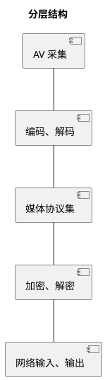

# 基于浏览器的双向AV通信
## 目标
1. 适用弱网，以及各种网络
1. 安全
1. 易于使用
1. 易于扩展
1. 
# 层

每个层都提供一部分功能也使用一部分功能。所以着重区分每个层的输入、输出。这个清楚了层间就清楚了。层内再分而治之递归下去即可。  
# 发送（从采集到网络）
## 采集
数据采集一般有两种方式
1. 外部控制频率
系统提供输入API，由外部主动放数据进去
1. 内部控制频率
系统提供回调，由内部根据自己的逻辑调用回调获取数据。

在浏览器里，一个GetMedia就能搞定了。自用的复杂一些
WebRTC 采用前者。
```plantuml
title video
package webrtc {
    interface PeerConnectionObserver
    interface CreateSessionDescriptionObserver
    interface AudioTrackSinkInterface
}
package rtc { 
    interface VideoSinkInterface
    class AdaptedVideoTrackSource {
        + OnFrame(VideoFrame & frm) // 自有
    }
    class VideoBroadcaster {

    }
    VideoSinkInterface <|.. VideoBroadcaster
    VideoSourceInterface <|.. VideoSourceBase 
    VideoSourceBase <|.. VideoBroadcaster
    VideoBroadcaster "1" *--> "*" VideoSinkInterface 
    AdaptedVideoTrackSource ..> VideoBroadcaster
}
App --|> AdaptedVideoTrackSource
```
APP 类是外部输入的入口点。
VideoBroadcaster 是个组合模式。加入到它的VideoSinkInterface都能收到输出。
FAQ: 
1. VideoSourceBase 作用是什么？
1. 
```plantuml
title audio 
package webrtc {
    class AudioProcessingImpl {
        + ProcessStream(AudioFrame* frm)
    }
}
```
## 编码
编码由于比较慢，所以一般是异步。
输入队列 --> 编码过程 --> 输出回调
```plantuml
title video 
package webrtc {
    interface VideoEncoder {
        Encode()
        RegisterEncodeCompleteCallback()

    }
    interface EncodedImageCallback {
        OnEncodedImage()
    }
    interface VideoStreamInterface
    interface EncoderSink {
        OnEncoderConfigurationChanged()
        ....
    }
    class VideoSender {
        AddVideoFrame() 
    }
    class VideoStreamEncoder {
        1. 缓冲区在这里
    }
    VideoStreamInterface +-- EncoderSink
    EncodedImageCallback <|.. VideoStreamEncoder
    EncodedImageCallback <|.. EncoderSink
    VideoStreamEncoder *-> rtc.TaskQueue
    VideoStreamEncoder .right.> VideoSender :use
    VideoSender .right.> VideoEncoder : use
    VideoEncoder .right.> EncodedImageCallback : use
}
```

```plantuml
title video 
participant VideoStreamEncoder as VSE
participant VideoSender as VS
participant VideoEncoder as VE
participant EncodedImageCallback as CB
participant VideoStreamEncoderInterface.EncoderSink AS ES
->> VSE : OnFrame
activate VSE
VSE --> VS : AddVideoFrame
activate VS
VS --> VE : Encode
activate VE
VE --> VSE : OnEncodeImage
activate VSE
VSE --> ES : OnEncodedImage
```
缓冲区在VideoStreamEncoder那儿。它接收原始数据，输出编码数据流。那它是如何接收原始数据呢？它肯定要从一个接口派生来接收数据。
```plantuml
package rtc {
    interface VideoSinkInterface {
        OnFrame
    }
}
package webrtc {
interface VideoStreamEncoderInterface
VideoSinkInterface <|.. VideoStreamEncoderInterface
VideoStreamEncoderInterface <|.. VideoStreamEncoder
}
```
所以，只要能向VideoSinkInterface数据，就能放数据到VideoStreamEncoder.恰巧 **VideoBroadcaster 可以做这件事**
FAQ: 
1. VideoStreamEncoderInterface 的价值？
1. 如果想增加一种编码格式应该怎么做？
1. 如果想增加多分辨率输出应该怎么做？  

输出，由于VideoStreamEncoder 实现了EncodedImageCallback接口，所以回调又调回来了。由它继续向VideoStramEncoder::EncoderSink传递。EncoderSink 增加了编码配置变更功能

## 传输
```plantuml
title "video"
namespace webrtc { 
    class VideoSendStream
    interface RtpVideoSenderInterface {
        OnEncodedImage()
    }
    interface EncoderImageCallback
    interface EncoderSink
    EncoderSink ..|> EncoderImageCallback
    RtpVideoSenderInterface +-- EncoderSink
    namespace internal {
        VideoSendStream --|> webrtc.VideoSendStream
        VideoSendStream *-- VideoSendStreamImpl  : use
        VideoSendStreamImpl ..|> webrtc.EncoderSink
        VideoSendStreamImpl *-- RtpVideoSenderInterface : <<create>> and use
    }
}
```
从 VideoSendStreamImpl 看起，它派生自 EncoderSink ， 因此可以接收数据; 收到的数据通过 RtpVideoSenderInterface 的派生类发出去。
EncoderSink 派生自 EncoderImageCallback 表明可以接收编码阶段的输出。
```plantuml
title video
participant VideoSendStreamImpl as vssi <<VideoStreamEncoderInterface::EncoderSink>>
participant RtpVideoSender as rtpvs <<RtpVideoSenderInterface>>

-> vssi : OnEncodedImage
activate  vssi 
vssi --> rtpvs : OnEncodedImage
```
VideoSendStreamImpl 从 VideoStreamEncoderInterface::EncoderSink 派生，意在能接收编码阶段的输出，与编码阶段衔接;VideoSendStream使用 VideoSendStreamImpl意在做接口-实现分离;使用RtpVideoSenderInterface意在把编码数据发向rtp.
```plantuml
package webrtc { 
    interface RtpVideoSenderInterface
    interface RtpTransportControllerSendInterface {
        作用暂时不明
    }
    interface RtpRtcp {
        SendOutgoingData()
    }
    interface RtcpFeedbackSenderInterface
    RtpVideoSender ...|> RtpVideoSenderInterface
    RtpVideoSender "1" *--> "*" RtpRtcp
    RtpVideoSender o-> RtpTransportControllerSendInterface
    RtpRtcp --|> Module
    RtpRtcp --|> RtcpFeedbackSenderInterface
}
```
目光转移到 RtpVideoSender ,它使用RtpRtcp。RtpRtcp从名字上看rtp,rtcp全包了,父类 RtcpFeedbackSenderInterface 明显是用于处理rtcp包。  
RtpRtcp 接收从 RtpVideoSender 传来的 Transport, 并使用。 所有的RtpRtcp 实例共享一个 Transport. 
```plantuml
package webrtc { 
    class RTPSender {
       + SendOutgoingData()
    }
    ModuleRtpRtcpImpl ..|> RtpRtcp
    ModuleRtpRtcpImpl ..|> RTCPReceiver.ModuleRtpRtcp
    ModuleRtpRtcpImpl o--> RTPSender
    RTPSender *--> RTPSenderVideo
    RTPSenderVideo *--> Transport
    RTPSender *--> RTPSenderAudio
}
```
RtpSender 拥有 RtpSenderVideo/RtpSenderAudio 因此可以发AV两种数据。 
```plantuml
participant RtpVideoSender as rvs <<RTPVideoSenderInterface>>  
participant ModuleRtpRtcpImpl as mrtprtcpi <<RtpRtcp>>
participant rtp_sender_  as rtps <<RTPSender>>
participant rtpsendervideo as rptsv <<RTPSenderVideo>>
participant transport_ as transport <<Transport>>

-> rvs : OnEncodedImage
rvs -> mrtprtcpi : SendOutgoingData
mrtprtcpi -> rtps : SendOutgoingData
rtps -> rptsv : SendVideo
rptsv -> rtps : SendToNetwork
rtps -> transport : SendRtp 
```
在 RTPSender 中，区分了音频和视频，然后各自发送。以 Video 为例。
到了RTPSenderVideo后，就打成RTP包。交给 Transport 。
````plantuml
title "video"
package webrtc { 
    interface Transport {
        SendRtcp()
        SendRtp()
    }
    interface Call 
    note right: 实现Stream创建功能。

    class RtpTransportInternal {}
}
package cricket {
    interface NetworkInterface {
        SendPacket()
        SendRtcp()
        SetOption()
    }
    MediaChannel +-- NetworkInterface
    VideoMediaChannel --|> MediaChannel
    WebRtcVideoChannel --|> VideoMediaChannel
    WebRtcVideoChannel --|> Transport
    WebRtcVideoChannel o--> Call 

    BaseChannel ..|> NetworkInterface
    BaseChannel *-- RtpTransportInternal
    VoiceChannel --|> BaseChannel
    VideoChannel --|> BaseChannel
}
````
从 WebRtcVideoChannel 看起，它是 Transport 派生类，可用于发数据，上层可通过 Transport 向它传数据。它使用 NewworkInterface 完成实际发送。实质发送由 NetworkInerface 派生类完成，即:  VideoChannel
```plantuml
participant WebRtcVideoChannel as wvc <<Transport>>  
participant VoiceChannel as bc <<NetworkInterface>>
participant rtptrasnport as rtpti <<RtpTransportInternal>>
-> wvc : SendRtp
wvc -> bc : SendRtp
bc -> rtpti : SendRtp
```
VoiceChannel 派生自 BaseChannel,因此它可以使用 BaseChannel 的功能。
RtpTransportInernal 是接口，由另一部分提供功能。

```plantuml
package webrtc { 
    interface RtpTransportInterface
    interface SrtpTransportInterface
    interface RtpTransportInternal
    RtpTransport *-- rtc.PacketTransportInternal
    RtpTransport ..|> RtpTransportInternal
    RtpTransportInternal ..|> SrtpTransportInterface
    SrtpTransportInterface ..|> RtpTransportInterface
}
package rtc {
    interface PacketTransportInternal
}
package cricket {
    interface DtlsTransportInternal
    interface IceTransportInternal
    DtlsTransportInternal ..|> rtc.PacketTransportInternal
    DtlsTransport ..|> DtlsTransportInternal
    DtlsTransport *-- IceTransportInternal
    P2PTransportChannel ..|> IceTransportInternal
}
```
从 RtpTransport 看起， 使用 PacketTransportInternal 的功能实现发送。实质上使用的是 DtlsTransport, DtlTransport 再使用IceTransportInternal 的功能, 实质上使用的是 P2PTransportChannel.
```plantuml
participant rtp_transport_ <<RtpTransportInternal>> 
participant transport_ <<DtlsTransport>> 
participant ice_transport_ <<P2PTransportChannel>>  
participant selected_conn <<Connection>>
->  rtp_transport_ : SendPacket
rtp_transport_ -> transport_ : SendPacket
transport_ -> ice_transport_ : SendPacket
ice_transport_ -> selected_conn : Send
```
从rtp到dtls再到ice,没什么需要额外说明的，很清楚。P2PTransportChannel 表示一个ICE连接，selected_conn 代表一个UDP连接。
````plantuml
package cricket { 
    interface CandidatePairInerface {
        local_candidate()
        remote_candidate()
    }
    Connection ..|> CandidatePairInerface
    Connection ..|> rtc.MessageHandler
    ProxyConnection --|> Connection
    ProxyConnection *-- Port
    Port ..|> PortInterface
    Port ..|> rtc.MessageHandler
    UDPPort --|> Port
    UDPPort o--> rtc.AsyncPacketSocket
    StunPort --|> UDPPort
}
````
```plantuml 
title "data flow"
participant connect_ <<ProxyConnection>>
participant port_ <<StunPort>>
participant socket_ <<AsyncPacketSocket>>
-> connect_ : Send
connect_ -> port_ : SendTo
port_ -> socket_ : SendTo
```
Connection 类的对象响应线程消息事件，收取数据时会用到。
UDPPort 使用 rtc.AsyncPacketSocket实现发送。
```plantuml
package rtc { 
    class AsyncPacketSocket
    AsyncUDPSocket *-- AsyncSocket
    AsyncUDPSocket --|> AsyncPacketSocket
    PhysicalSocket --|> AsyncSocket
    AsyncSocket --|> Socket
}
```
```plantuml
participant socket_ <<AsyncUDPSocket>>
participant socket__ <<PhysicalSocket>> 
-> socket_ : SendTo
socket_ -> socket__ : SendTo
socket__ -> SystemAPI : sendto
```
最终调用系统API，实现发送功能。
## 渲染
