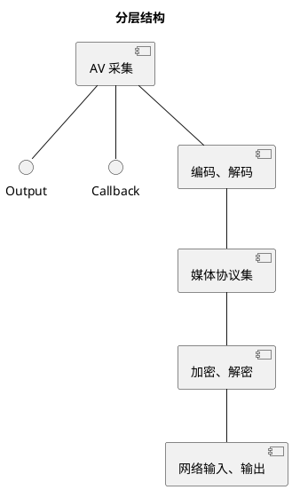

# 基于浏览器的双向AV通信
## 目标
1. 适用弱网，以及各种网络
1. 安全
1. 易于使用
1. 易于扩展
1. 
# 层

# 发送（从采集到网络）
## 采集
数据采集一般有两种方式
1. 外部控制频率
系统提供输入API，由外部主动放数据进去
1. 内部控制频率
系统提供回调，由内部根据自己的逻辑调用回调获取数据。

在浏览器里，一个GetMedia就能搞定了。自用的复杂一些
WebRTC 采用前者。
```plantuml
title video
package webrtc {
    interface PeerConnectionObserver
    interface CreateSessionDescriptionObserver
    interface AudioTrackSinkInterface
}
package rtc { 
    interface VideoSinkInterface
    class AdaptedVideoTrackSource {
        + OnFrame(VideoFrame & frm) // 自有
    }
    class VideoBroadcaster {

    }
    VideoSinkInterface <|.. VideoBroadcaster
    VideoSourceInterface <|.. VideoSourceBase 
    VideoSourceBase <|.. VideoBroadcaster
    VideoBroadcaster "1" *--> "*" VideoSinkInterface 
    AdaptedVideoTrackSource ..> VideoBroadcaster
}
App --|> AdaptedVideoTrackSource
```
APP 类是外部输入的入口点。
VideoBroadcaster 是个组合模式。加入到它的VideoSinkInterface都能收到输出。
FAQ: 
1. VideoSourceBase 作用是什么？
1. 
```plantuml
title audio 
package webrtc {
    class AudioProcessingImpl {
        + ProcessStream(AudioFrame* frm)
    }
}
```
## 编码
编码由于比较慢，所以一般是异步。
输入队列 --> 编码过程 --> 输出回调
```plantuml
title video 
package webrtc {
    interface VideoEncoder {
        Encode()
        RegisterEncodeCompleteCallback()

    }
    interface EncodedImageCallback {
        OnEncodedImage()
    }
    interface VideoStreamInterface
    interface EncoderSink {
        OnEncoderConfigurationChanged()
        ....
    }
    class VideoSender {
        AddVideoFrame() 
    }
    class VideoStreamEncoder {
        1. 缓冲区在这里
    }
    VideoStreamInterface +-- EncoderSink
    EncodedImageCallback <|... VideoStreamEncoder
    EncodedImageCallback <|... EncoderSink
    VideoStreamEncoder *--> rtc.TaskQueue
    VideoStreamEncoder .right.> VideoSender :use
    VideoSender .right.> VideoEncoder : use
    VideoEncoder .right.> EncodedImageCallback : use
}
```

```plantuml
title video 
participant VideoStreamEncoder as VSE
participant VideoSender as VS
participant VideoEncoder as VE
participant EncodedImageCallback as CB
participant VideoStreamEncoderInterface.EncoderSink AS ES
->> VSE : OnFrame
activate VSE
VSE --> VS : AddVideoFrame
activate VS
VS --> VE : Encode
activate VE
VE --> VSE : OnEncodeImage
activate VSE
VSE --> ES : OnEncodedImage
```
缓冲区在VideoStreamEncoder那儿。它接收原始数据，输出编码数据流。那它是如何接收原始数据呢？它肯定要从一个接口派生来接收数据。
```plantuml
interface rtc.VideoSinkInterface {
    OnFrame
}
package webrtc {
interface VideoStreamEncoderInterface
rtc.VideoSinkInterface <|.. VideoStreamEncoderInterface
VideoStreamEncoderInterface <|.. VideoStreamEncoder
}
```
所以，只要能向VideoSinkInterface数据，就能放数据到VideoStreamEncoder.
FAQ: 
1. VideoStreamEncoderInterface 的价值？
1. 如果想增加一种编码格式应该怎么做？
1. 如果想增加多分辨率输出应该怎么做？  

输出，由于VideoStreamEncoder 实现了EncodedImageCallback接口，所以回调又调回来了。由它继续向VideoStramEncoder::EncoderSink传递。EncoderSink 增加了编码配置变更功能

## 传输
```plantuml
namespace webrtc { 
    class VideoSendStream
    interface RtpVideoSenderInterface {
        OnEncodedImage()
    }
    namespace internal {
        VideoSendStream --|> webrtc.VideoSendStream
        VideoSendStream *-- VideoSendStreamImpl  : use
        VideoSendStreamImpl ..|> VideoStreamEncoderInterface::EncoderSink
        VideoSendStreamImpl *-- RtpVideoSenderInterface : <<create>> and use
    }
}
```
```plantuml
participant VideoSendStreamImpl 
-> VideoSendStreamImpl : OnEncodedImage
activate  VideoSendStreamImpl 
VideoSendStreamImpl --> RtpVideoSenderInterface : OnEncodedImage
```
VideoSendStreamImpl 从VideoStreamEncoderInterface::EncoderSink派生，意在能接收编码阶段的输出，与编码阶段衔接;VideoSendStream使用 VideoSendStreamImpl意在做接口-实现分离;使用RtpVideoSenderInterface意在把编码数据发向rtp.
```plantuml
package webrtc { 
    interface RtpVideoSenderInterface
    interface RtpRtcp {
        SendOutgoingData()
    }
    interface RtcpFeedbackSenderInterface
    RtpVideoSender ...|> RtpVideoSenderInterface
    RtpVideoSender "1" *--> "*" RtpRtcp
    RtpRtcp --|> Module
    RtpRtcp --|> RtcpFeedbackSenderInterface
}
```
目光转移到RtpVideoSender,它使用RtpRtcp。RtpRtcp从名字上看rtp,rtcp全包了,父类RtcpFeedbackSenderInterface明显是用于发送rtcp包。
```plantuml
package webrtc { 
    class RTPSender {
       + SendOutgoingData()
    }
    ModuleRtpRtcpImpl ..|> RtpRtcp
    ModuleRtpRtcpImpl ..|> RTCPReceiver.ModuleRtpRtcp
    ModuleRtpRtcpImpl o--> RTPSender
    RTPSender *--> RTPSenderVideo
    RTPSenderVideo *--> Transport
    RTPSender *--> RTPSenderAudio
}
```
```plantuml
participant video_sender_ <<RTPVideoSender>>  
participant ModuleRtpRtcpImpl
participant rtp_sender_ <<RTPSender>>
-> video_sender_ : OnEncodedImage
video_sender_ -> ModuleRtpRtcpImpl : SendOutgoingData
ModuleRtpRtcpImpl -> rtp_sender_ : SendOutgoingData
rtp_sender_ -> RTPSenderVideo : SendVideo
RTPSenderVideo -> rtp_sender_ : SendToNetwork
rtp_sender_ -> Transport : SendRtp 
```
在RTPSender中，区分了音频和视频，然后各自发送。以Video为例。
到了RTPSenderVideo后，就打成RTP包。交给Transport。
````plantuml
package webrtc { 
    interface Transport {
        SendRtcp()
        SendRtp()
    }
    class RtpTransportInternal {}
}
package cricket {
    interface NetworkInterface {
        SendPacket()
        SendRtcp()
        SetOption()
    }
    MediaChannel +-- NetworkInterface
    VideoMediaChannel -left-|> MediaChannel
    WebRtcVideoChannel -left-|> VideoMediaChannel
    WebRtcVideoChannel -left-|> Transport

    BaseChannel ..|> NetworkInterface
    BaseChannel *-- RtpTransportInternal
    RtpDataChannel --|> BaseChannel
    VoiceChannel --|> BaseChannel
    VideoChannel --|> BaseChannel
}
````
```plantuml
participant WebRtcVideoChannel  
participant BaseChannel <<NetworkInterface>>
-> WebRtcVideoChannel : SendRtp
WebRtcVideoChannel -> BaseChannel
BaseChannel -> RtpTransportInternal
```
Transport 用于数据发送
WebRtcVideoChannel 开始执行
BaseChannel功能比它的派生类多。
FAQ:
1. NetworkInterface 如何与ICE的 Connection 关联起来

```plantuml
package webrtc { 
    interface RtpTransportInterface
    interface SrtpTransportInterface
    interface RtpTransportInternal
    RtpTransport *-- rtc.PacketTransportInternal
    RtpTransport .left.|> RtpTransportInternal
    RtpTransportInternal .left.|> SrtpTransportInterface
    SrtpTransportInterface .left.|> RtpTransportInterface
}
package rtc {
    interface PacketTransportInternal
}
package cricket {
    interface DtlsTransportInternal
    interface IceTransportInternal
    DtlsTransportInternal ..|> rtc.PacketTransportInternal
    DtlsTransport ..|> DtlsTransportInternal
    DtlsTransport *-- IceTransportInternal
    P2PTransportChannel ..|> IceTransportInternal
}
```
```plantuml
participant rtp_transport_ <<RtpTransport>> 
participant transport_ <<DtlsTransport>> 
participant ice_transport_ <<P2PTransportChannel>>  
participant selected_conn <<Connection>>
->  rtp_transport_ : SendPacket
rtp_transport_ -> transport_ : SendPacket
transport_ -> ice_transport_ : SendPacket
ice_transport_ -> selected_conn : Send
```
从rtp到dtls再到ice,没什么需要额外说明的，很清楚。P2PTransportChannel 表示一个ICE连接，selected_conn 代表一个UDP连接。
````plantuml
package cricket { 
    interface CandidatePairInerface {
        local_candidate()
        remote_candidate()
    }
    Connection ..|> CandidatePairInerface
    Connection ..|> rtc.MessageHandler
    ProxyConnection --|> Connection
    ProxyConnection *-- Port
    Port ..|> PortInterface
    Port ..|> rtc.MessageHandler
    UDPPort --|> Port
    UDPPort o--> rtc.AsyncPacketSocket
    StunPort --|> UDPPort
}
````
```plantuml 
participant connect_ <<ProxyConnection>>
participant port_ <<StunPort>>
participant socket_ <<AsyncPacketSocket>>
-> connect_ : Send
connect_ -> port_ : SendTo
port_ -> socket_ : SendTo
```
Connection 类的对象响应线程消息事件，收取数据时会用到。
UDPPort 使用 rtc.AsyncPacketSocket实现发送。
```plantuml
package rtc { 
    class AsyncPacketSocket
    AsyncUDPSocket *-- AsyncSocket
    AsyncUDPSocket --|> AsyncPacketSocket
    PhysicalSocket --|> AsyncSocket
    AsyncSocket --|> Socket
}
```
```plantuml
participant socket_ <<AsyncUDPSocket>>
participant socket__ <<PhysicalSocket>> 
-> socket_ : SendTo
socket_ -> socket__ : SendTo
socket__ -> SystemAPI : sendto
```
最终调用系统API，实现发送功能。
## 渲染
