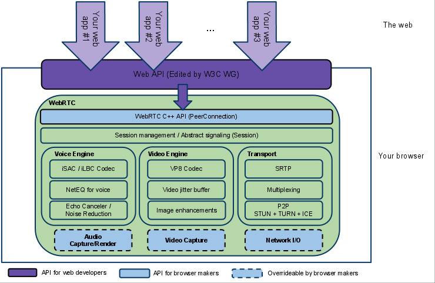

<!-- TOC -->

- [架构](#架构)
- [组件](#组件)
- [流程](#流程)
- [代码](#代码)

<!-- /TOC -->

**基于M70版本**
# 架构

- [概览](./Design.md)
- [线程模型](./Thread.md)
- [媒体引擎](./mediaEngine.md)
# 组件
- [total](./component.md)
- [modual](./modules.md)
- [network IO](./socket.md)
- [thread](./Thread.md)
- [mediaEngine](./mediaEngine.md)
- [peerConnection](./peerconnection.md)
- [datachannel](./datachannel.md)
- [transceiver](./transceiver.md)
- [call](./call.md)
# 流程
- [setLocalDescritpion](./setLocalDescritpion.md)
- [setRemoteSDP](./setRemoteSdp.md)
# 代码
- [编译](./project.md)
- [结构](./dirStruct.md)
- [通用技法](./commonTeach.md)
