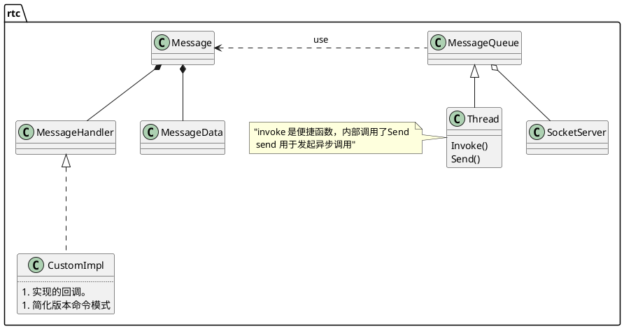

# thread  

## 结构

MessageQueue 在其 Get 方法中处理 socket 的内容，在Dispatch中处理其它内容。因此它支持异步socket.
除此之外，还有signal-slot,谁想接收谁去实现slot.
**线程可以驱动网络IO，也可以作为消息循环而存在。有了它凡是异步操作都可以经由它实现。**
ThreadManager并不是管理Thread集，只是Thread的封装，方便管理而已。
