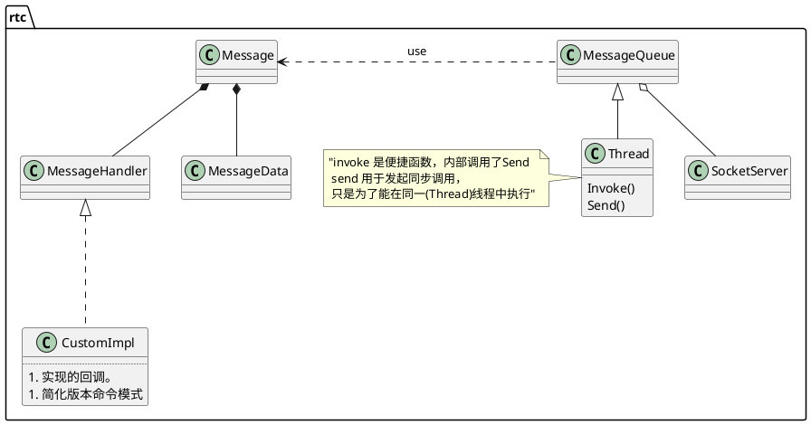

# thread  

## 结构

```plantuml
title "处理过程"
participant thr_  as thr <<Thread>>
participant mq_  as mq <<MessageQueue>>
participant ss_  as ss <<PyhsicalSocketServer>>
participant mh_  as mh <<MessageHandler>>
loop true
[-> thr : PrrocessMessage
activate thr
thr -> thr : Get
activate thr
thr -> ss : Wait
deactivate 
thr -> thr : Dispatch
activate thr
thr -> mh : OnMessage
activate mh
return 
end
```
MessageQueue(Thread) 在其 Get 方法中处理 socket 的内容，在Dispatch中处理其它内容。因此它支持异步socket.
**线程可以驱动网络IO，也可以作为消息循环而存在。有了它凡是异步操作都可以经由它实现。**
ThreadManager并不是管理Thread集，只是Thread的封装，方便管理而已。
# ProcessThread(处理线程)
音视频程序在本质上都是 pipeline&Filter 架构模式。webrtc 的模块相当于Filter。 出于质量保证与监控需求，要有专门线程收集和处理模块内部的状态信息，并反馈给目标模块实现动态控制。
```plantuml
interface ProcessThread
interface QueuedTask
class ProcessThreadImpl
interface Module
ProcessThreadImpl ..|> ProcessThread
ProcessThreadImpl "1" *--> "*" Module
ProcessThreadImpl "1" *--> "*" QueuedTask
```
```plantuml
title "处理过程"
participant pci_  as pci <<ProcessThreadImpl>>
participant mods_  as mods <<Module>>
participant qtasks_  as qtasks <<QueuedTask>>

[-> pci : Process
loop mods len
pci -> Module : Process
end
loop qtasks len
pci -> QueuedTask : Run
end
```
```plantuml
title "添加"
participant pci_  as pci <<ProcessThreadImpl>>
participant mod_  as mod <<Module>>
participant qtasks_  as qtasks <<QueuedTask>>
[-> pci : PostTask
pci -> pci : push queue
==注册模块==
[-> pci : RegisterModule
pci -> mod : ProcessThreadAttached(this)
pci -> pci : push queue
```
如上图， mod 有机会知道处理自己的线程。派生类可以根据需要决定是否保存线程指针。  
使用方式也很简单明了了。如果是模块，就从 Module 派生，然后把自己注册给 ProcessThread;如果是任务，从 QueuedTask 派生， 然后 Post 给 ProcessThread.  

# ProcessThread in webrtc
webrtc有三个线程： 
PacerProcessThread,  负责数据平滑   
voiceProcessThread,  负责音频处理
ModuleProcessThread 负责 AV 同步