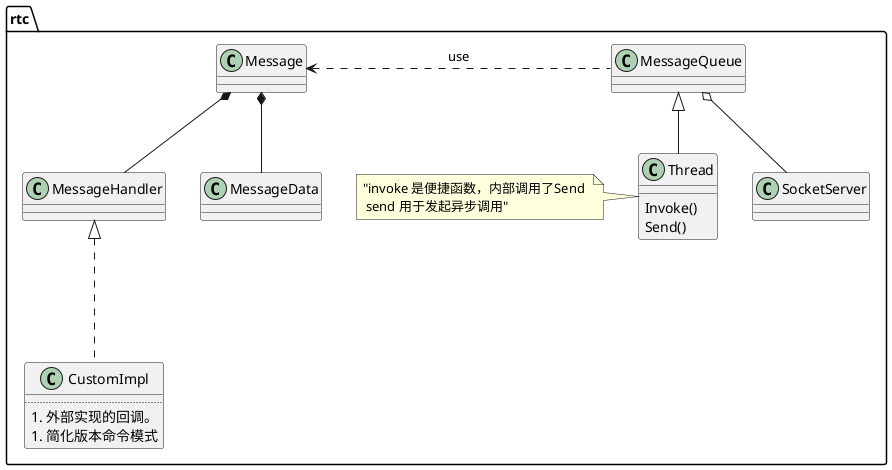

# thread  

## 结构

除此之外，还有signal-slot,谁想接收谁去实现slot.
**线程可以驱动网络IO，也可以作为消息循环而存在。有了它凡是异步操作都可以经由它实现。**
ThreadManager并不是管理Thread集，只是Thread的封装，方便管理而已。

# 联系
它有三个线程。network/work/sign,好像这路不怎么好走。  
ThreadManager::WrapCurrentThread 会创建新线程，并返回出去。顺着找到了OrtcFactory.
OrtcFactory--->OrtcFactoryInterface,它以一堆工厂做参数，持有worker_thread感觉像个组装车间。太太太NB。

# 疑问
ICE是在哪儿实现的？
由P2PTransportChannel实现