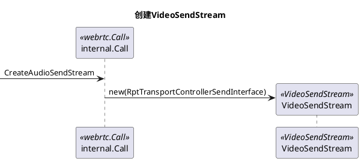

**src/call 目录下的内容与 Call 相关**
```plantuml
namespace webrtc {
    interface CallFactoryInterface
    CallFactory ..> internal.Call : <<create>>
    CallFactory ..|> CallFactoryInterface
    interface Call {
        CreateAudioSendStream()
        CreateVideoSendStream()
        CreateAudioReceiveStream()
        CreateVideoReceiveStream()
        CreateFlexfecReceiveStream()
    }
    interface PacketReceiver
    interface RecoverdPacketReceiver {
        OnRecoverdPacket()
    }
    note left: for recv fec
    namespace internal {
        interface RtpTransportControllerSendInterface
        class Call {
            {static} Create()
            ..管理..
            1.  AV 流
            1. 收发 AV 数据
        }
        Call *--> RtpTransportControllerSendInterface
        Call --|> webrtc.Call
        Call --|> webrtc.PacketReceiver
        Call --|> webrtc.RecoverdPacketReceiver
    }
}
```
CallFactory 作为 Call 的工厂，创建具体 Call 实例。  
internal::Call 派生自 webrtc::Call,实现”创建“自身； 派生自 PacketReceiver 实现数据接收；  
Call 被 WebRtcVideoEngine/WebRtcAudioEngine 使用，用于创建 Stram.  
它创建的对象在编解码功能的上层.  
RtpTransportControllerSendInterface 实例用于拥塞与流控。
```plantuml
title "创建ModuleProcessThread“
participant pcf_  as pcf <<PeerConnectionFactory>>
participant callFattory_  as cf <<CallFactory>>
participant call_  as call <<Call>>
participant icall_  as icall <<internal.Call>>
participant modPt_  as modPT <<ProcessThread>>
-> pcf : CreateCall_w
pcf -> cf : CreateCall
cf -> call : Create
create icall
call -> icall : new
create modPT
icall -> modPT : create
return pt
```
CallFactory 实例在创建 PeerConnectionFactory 前创建，
Call 组件的地位处于中游，上接 MediaEngine, 下接 Transport.  

