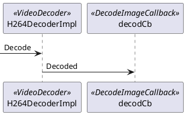

```plantuml
title ""
package webrtc {
    interface VideoDecoder {
        Decode()
    }
    interface DecodeImageCallback
    H264Decoder ..|> VideoDecoder
    H264DecoderImpl ..|> H264Decoder
    H264DecoderImpl ..> H264BitstreamParser
    H264DecoderImpl o--> DecodeImageCallback
}
```
H264Decoder 用于创建自身实例。  
DecodeImageCallback 是回调接口。
