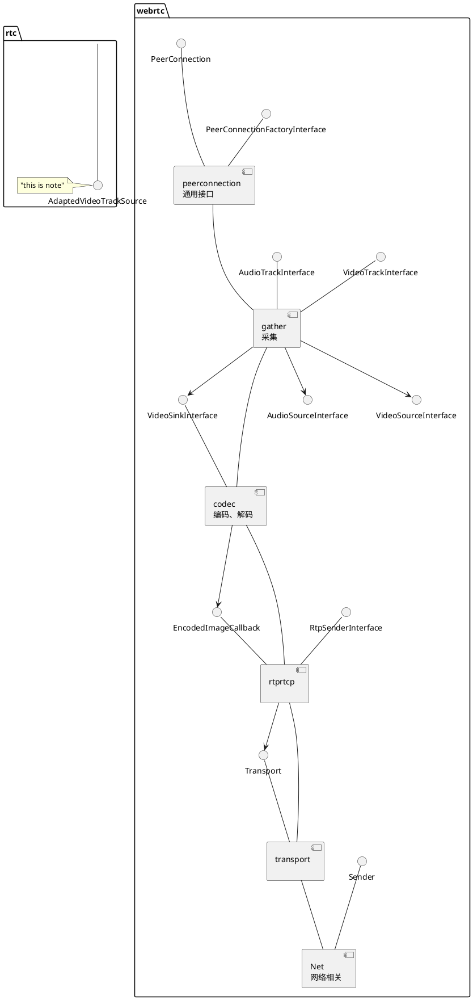

# 用户角度

```plantuml
@startuml
package webrtc {
    component peerconnection [peerconnection
        通用接口
    ] 
    component gather [gather
    采集
    ] 
    component codec [codec
        编码、解码
    ] 
    component rtprtcp [rtprtcp

    ] 
    component transport [transport

    ]
    component net [Net
        网络相关
    ]
    peerconnection --down- gather
    gather --down- codec
    codec --down-- rtprtcp
    rtprtcp --down- transport
    transport --down- net

    [peerconnection] --up- PeerConnection
    [peerconnection] -up- PeerConnectionFactoryInterface

    [gather] -->  AudioSourceInterface 
    [gather] -->  VideoSourceInterface
    [gather] --> VideoSinkInterface
    [gather] -up-  AudioTrackInterface
    [gather] -up-  VideoTrackInterface

    [codec] -up-- VideoSinkInterface
    [codec] ---> EncodedImageCallback

    [rtprtcp] -up- RtpSenderInterface
    [rtprtcp] -up- EncodedImageCallback
    [rtprtcp] --> Transport
    [transport] --up- Transport

    [net] --up- Sender
}
package rtc {
    [rtc] --- AdaptedVideoTrackSource 
    note left: "this is note"
}

@enduml
```

实现自己的 VideoSource 可以从AdaptedVideoTrackSource 派生