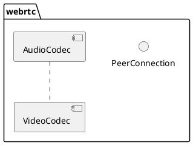
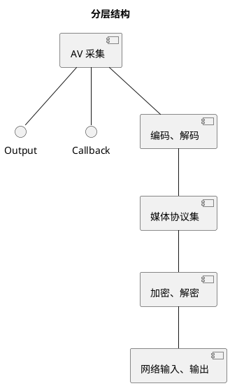

# 高层

```plantuml
@startuml
package webrtc {
    () PeerConnection
    [AudioCodec] .. [VideoCodec]
}
@enduml
```

以编码器的角度看，需要一个输入，提供一个输出。由于操作耗时，需要异步。还得支持不同的编码标准。

以用户的角度看，给把应该给的给了。就能得到结果。

```plantuml
@startuml
title 分层结构
[AV 采集] AS 1
1 -- Output
1 -- Callback
[编码、解码] AS 2
[媒体协议集] AS 3
[加密、解密] AS 4 
[网络输入、输出] AS 5

1 -- 2
2 -- 3
3 -- 4
4 -- 5
@enduml
```
