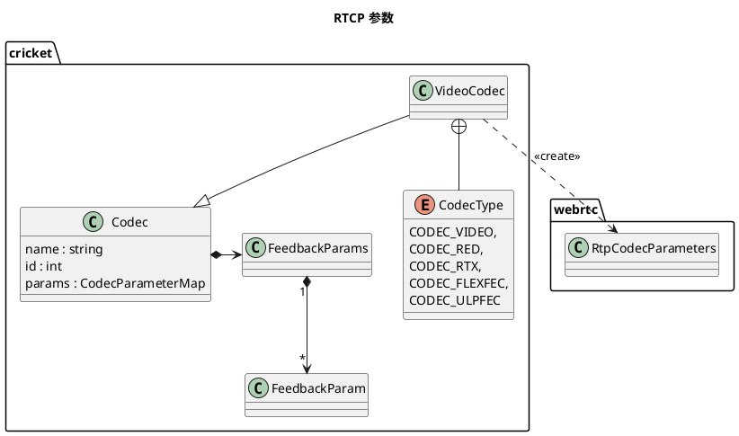

# MediaEngine
**因为变化较大，这里没依据M70，依据M97**
```plantuml
package webrtc {
    interface AudioEncoderFactory
    interface AudioDecoderFactory
    interface VideoEncoderFactory
    interface VideoDecoderFactory
    class AudioProcessing {

    }
    class AudioMixer
    
    VideoEncoderFactory ..> VideoEncoder : << create>>
    VideoDecoderFactory ..> VideoDecoder : << create>>

}
package rtc {
    interface VideoSourceInterface
}
package cricket {
    note  ”废弃了,\n 使用webrtc::VideoEncoderFactory“ as N1
    interface WebRtcVideoEncoderFactory
    interface WebRtcVideoDecoderFactory
    N1 .. WebRtcVideoDecoderFactory
    N1 .. WebRtcVideoEncoderFactory

    interface Sink
    interface MediaEngineInterface {
        voice() const 
        video() const
    }
    class ChannelManager
    class WebRtcMediaEngineFactory {
        {static} Create()
    }
    note left: "静态方法可以随便被调用 \n  
    
    ChannelManager ..> MediaEngineInterface : use
    CompositeMediaEngine ..|> MediaEngineInterface
    CompositeMediaEngine ..> WebRtcVoiceEngine : use
    CompositeMediaEngine ..> WebRtcVideoEngine : use
    WebRtcMediaEngineFactory ..> MediaEngineInterface : <<create>> 
    note on link: 接口间创建关系
    WebRtcMediaEngineFactory ..> CompositeMediaEngine : <<create>>

    WebRtcVideoEngine ..> WebRtcVideoChannel : <<create>>
    WebRtcVideoEngine o-> VideoDecoderFactory
    WebRtcVideoEngine o-> VideoEncoderFactory


    WebRtcVoiceEngine ..> WebRtcVoiceMediaChannel : <<create>>
    WebRtcVoiceEngine o--> AudioDecoderFactory
    WebRtcVoiceEngine o--> AudioEncoderFactory
    WebRtcVoiceEngine o--> AudioMixer
    WebRtcVoiceEngine o--> AudioProcessing

    WebRtcVideoChannel --|> VideoMediaChannel
    WebRtcVideoChannel +-- WebRtcVideoReceiveStream
    WebRtcVideoChannel +-- WebRtcVideoSendStream
    WebRtcVideoSendStream ..|> rtc.VideoSourceInterface

    WebRtcVoiceMediaChannel +-- WebRtcAudioReceiveStream
    WebRtcVoiceMediaChannel +-- WebRtcAudioSendStream
    WebRtcAudioSendStream ..|> Sink
    Audiosource +-- Sink
} 
```
ChannelManager 被 PeerConnectionFactory 拥有,PeerConnection 持有 PerrConnectionFactory 实例，所以相关的创建活动由PeerConnection发起与操作。  
WebRtcAudio/VideoEngine 负责创建各自的 MediaChannel， 被 ChannelManager 使用。    
MediaEngineInterface 在 PeerConnectionFactoryDependience里，所以 PeerConnectionFactory 能访问到，PeerConnection 也能访问到。  
WebRtcVideoSendStream 派生自 VideoSourceInterface, 意在成为一个source, source 可以接多个Sink;实际它只是个wrapper。
```plantuml
title "创建 VoiceChannel"
participant chm  as chm <<ChannelManager>>
participant ve  as ve <<MediaEngineInterface>>
participant WebRtcVoiceMediaChannel  as vmc <<VoiceMediaChannel>>
participant WebRtcVoiceMediaChannel  as vc <<VoiceChannel>>

[-> chm : CreateVoiceChannel
chm -> ve : CreateChannel
create vmc
ve -> vmc : new
return 
create vc
chm -> vc : new(VoiceMediaChannel)
return 
```

```plantuml
title "创建WebRtcVideoSendStream“
participant WebRtcVideoChannel  as webrtcVC <<VideoChannel>>
participant WebRtcVideoSendStream  as webrtcVSS <<WebRtcVideoSendStream>>
participant VideoSendStream  as vss <<VideoSendStream>>
participant VideoSendStreamEncoder  as vsse <<VideoSendStreamEncoder>>
participant internal.Call  as call <<webrtc.Call>>
[-> webrtcVC : AddSendStream
create webrtcVSS
webrtcVC -> webrtcVSS : new
create vss
webrtcVSS -> vss : new
create vsse
vss -> vsse : new
=====
-> webrtcVSS : RecreateWebRtcStram
webrtcVSS -> call : CreateVideoSendStram
return VideoSendStream
```
第一次创建的时候由 WebRtcVideoChannel::AddSendStream 触发。  
之后 WebRtcVideoSendStream 使用 Call 重新创建 VideoSendStream.  
VideoSendStram 中 创建 VideoSendStreamEncoder， 它是编码的入口。



VideoCodec 生成 RtpCodecParameters , 然后交给SDP.