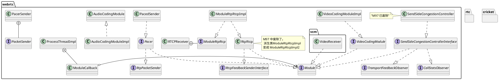
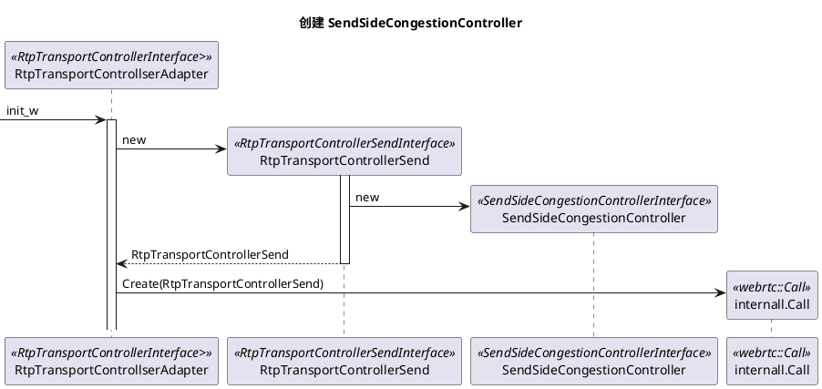

# 模块
模块是 webrtc 的一个组成部分，可以代指"活动对象"。

```plantuml
@startuml
namespace webrtc {
interface Module
interface ModuleRtpRtcp
interface RtcpFeedbackSenderInterface
interface VideoCodingModule
interface RtpPacketSender
interface PacketSender
interface Pacer
interface SendSideCongestionControllerInterface
interface TransportFeedbackObserver
interface CallStatsObserver
namespace vcm {
    VideoReceiver ..|> webrtc.Module
}
RTCPReceiver +- ModuleRtpRtcp

ProcessThreadImpl +-- ModuleCallback
ModuleCallback o-> Module

ModuleRtpRtcpImpl ..|> RtpRtcp
note right: M97 中废除了。\n 派生类ModuleRtpRtcpImpl \n变成 ModuleRtpRtcpImpl2
ModuleRtpRtcpImpl ..|> ModuleRtpRtcp

RtpRtcp ..|> RtcpFeedbackSenderInterface
RtpRtcp ..|> Module


VideoCodingModuleImpl ..|> VideoCodingModule
VideoCodingModule ..|> Module

AudioCodingModule <|.. AudioCodingModuleImpl
PacedSender ..|> Pacer
Pacer ..|> Module
Pacer ..|> RtpPacketSender

PacerSender +-- PacketSender

SendSideCongestionController ..|> SendSideCongestionControllerInterface
note left: "M97 已废除”
SendSideCongestionControllerInterface ..|> Module
SendSideCongestionControllerInterface ..|> TransportFeedbackObserver
SendSideCongestionControllerInterface ..|> CallStatsObserver

}
package rtc {

}
package cricket {

}
@enduml
```
ModuleRtpRtcp 用于处理常规 RTCP 包。  
AudioCodingModule  不是 module 的派生类。  

```plantuml
@startuml
title "创建 SendSideCongestionController"  
participant RtpTransportControllserAdapter as adapter <<RtpTransportControllerInterface>>>>  

participant RtpTransportControllerSend as rtptcs <<RtpTransportControllerSendInterface>>  
participant SendSideCongestionController as ssccr <<SendSideCongestionControllerInterface>> 
participant internall.Call as call <<webrtc::Call>> 


-> adapter : init_w
activate adapter
create rtptcs
adapter -> rtptcs : new
activate rtptcs
create ssccr
rtptcs -> ssccr : new
return RtpTransportControllerSend
create call
adapter -> call : Create(RtpTransportControllerSend)

@enduml
```
最终被传递给了 Call 