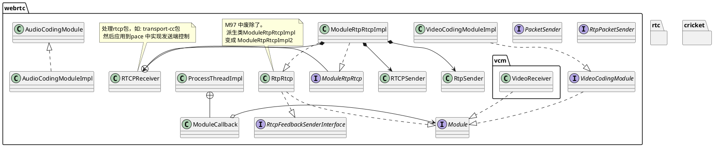
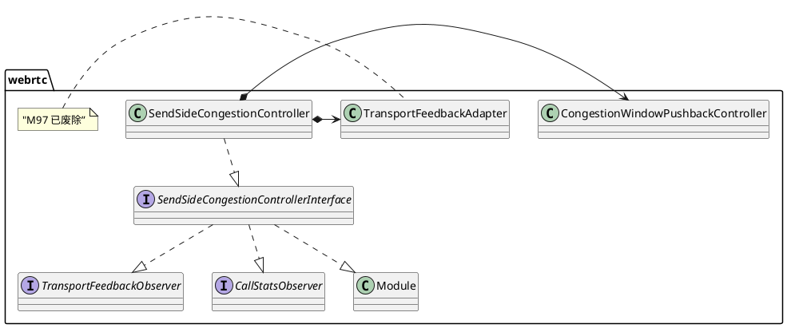
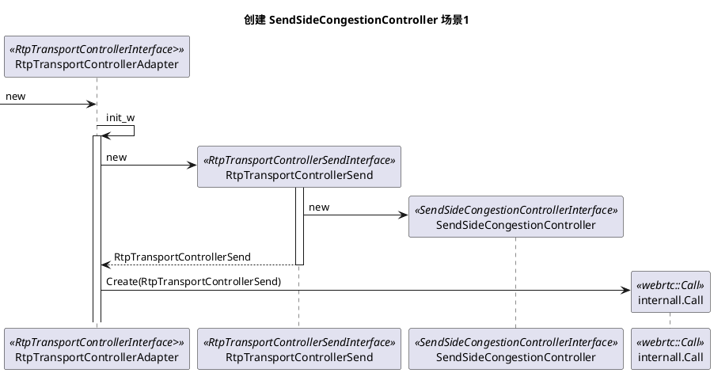

# 未完
# modules
模块是 webrtc 的一个组成部分，可以代指"活动对象"。 src/modules 目录下的都可以认为是模块的实现。  

ModuleRtpRtcp 用于处理常规 RTCP 包, 也可以发送 RTP 包。  
AudioCodingModule  不是 module 的派生类。  
```plantuml
@startuml
title ""

@enduml
```
## congestion_controller
1. 大体分twcc和gcc两类。
1. transport-cc/twcc/transport wide congestion control 是一个东西。
1. remb 是 gcc 的组成部分，用于延时相关过程。 丢包相关的通过 Rtcp 的 RR 传递。
1. 当前的拥塞避免与流控制都是通过“基于丢包”+“基于延时”两个方面。  
1. 由发送端计算的，叫发送端控制，反之就是接收端控制。gcc 是收端控制，因为是收端计算后通过REMB数据包传给发端的；twcc 是发端控制，因为接收端口只是忠实把丢包和延时统计后丢给发端(不做计算)再由发端计算。  

### sideSend


最终被传递给了 Call ,所以同实例创建的流共享拥塞控制。对于 Call 来说，是可选参数，传了就用，不传就自己创建。  
### transport cc(transport-wide congestion control)
```plantuml
title M97
package webrtc {
    interface Module
    interface CallStatsObserver {
        OnRttUpdate()
    }
    interface RemoteBitrateEstimator {
        IncomingPacket()
    }
    interface RemoteBitrateObserver

    note "接收端用于创建 twcc 包。" as N1
    RemoteEstimatorProxy .. N1
    RemoteEstimatorProxy ..|> RemoteBitrateEstimator
    RemoteBitrateEstimator ..|> Module
    RemoteBitrateEstimator ..|> CallStatsObserver
    RemoteBitrateEstimator ..> RemoteBitrateObserver : <<depends>>
    ReceiveSideCongestionController +-- WrappingBitrateEstimator
    WrappingBitrateEstimator *- RemoteBitrateEstimatorSingleStream
    RemoteBitrateEstimatorSingleStream ..|> RemoteBitrateEstimator
    WrappingBitrateEstimator ..|> RemoteBitrateEstimator
    ReceiveSideCongestionController ..|> Module
    ReceiveSideCongestionController ..|> CallStatsObserver
}

```
RemoteBitrateEstimatorSingleStream 是实际做事的类。输入是 IncomingPacket(), 输出是 observer。  
### goog_cc
```plantuml
title ""
package webrtc {
    interface AcknowledgedBitrateEstimatorInterface
    class LossBasedBandwidthEstimation
    class DelayBasedBwe
    class SendSideBandwidthEstimation
    AcknowledgedBitrateEstimator ..|> AcknowledgedBitrateEstimatorInterface
}
```
### p_cc
[pcc Document](https://www.usenix.org/system/files/conference/nsdi15/nsdi15-paper-dong.pdf)

## pacing
```plantuml
title ""
package webrtc {
    interface Module
    interface Pacer
    interface RtpPacketSender
    Pacer ..|> Module
    Pacer ..|> RtpPacketSender
    PacedSender ..|> Pacer
}
```
PacedSender 用来平滑发送。外部通过 RtpPacketSender 接口使用它， 从 Module 派生表明它有周期性执行的能力。
```plantuml
participant RtpSenderVideo as rsenderv <<RtpSenderVideo>>  
participant RtpSender as rsender <<RtpSender>>  
participant PacedSender as psender <<RtpPacketSender>>  
participant PacketRouter as prouter <<s>>  
participant ModuleRtpRtcpImpl as rtprtcp <<RtpRtcp>>  

[-> rsenderv : SendVideo
activate rsenderv
rsenderv -> rsenderv : SendVideoPacket
activate rsenderv
rsenderv -> rsender : SendToNetwork
rsender ->> psender : InsertPacket
psender -> psender : inQueue
=====
[-> psender : Process
activate psender

psender -> psender : SendPacket
activate psender
psender -> prouter : TimeToSendPacket
prouter -> rtprtcp : TimeToSendPacket
```
编码后的数据通过 Process 方法**异步**的把数据放入队列，然后在 Process 方法中根据时间发送出去。
这里的包已经是RTP/RTCP包了。 在 RtpSenderVideo 中包就变成了 RTP/RTCP 数据包了。