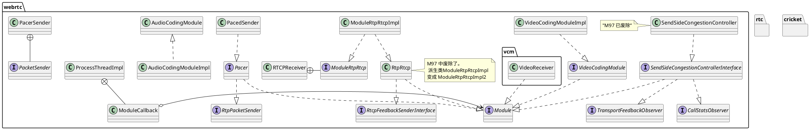
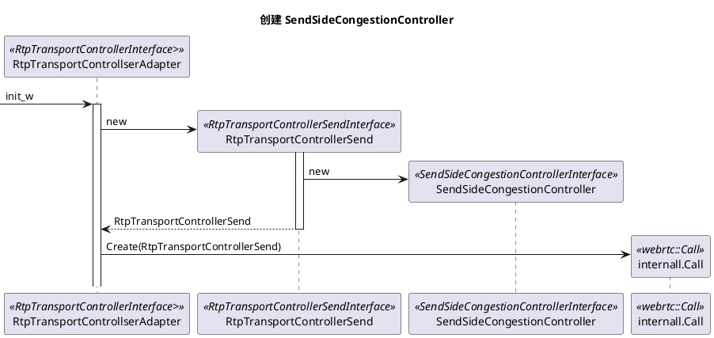

# modules
模块是 webrtc 的一个组成部分，可以代指"活动对象"。 src/modules 目录下的都可以认为是模块的实现。  

ModuleRtpRtcp 用于处理常规 RTCP 包。  
AudioCodingModule  不是 module 的派生类。  

最终被传递给了 Call ,所以同实例创建的流共享拥塞控制。
## congestion_controller
### transport cc
```plantuml
title M97
package webrtc {
    interface Module
    interface CallStatsObserver {
        OnRttUpdate()
    }
    interface RemoteBitrateEstimator {
        IncomingPacket()
    }
    interface RemoteBitrateObserver

    note "接收端用于创建 twcc 包。" as N1
    RemoteEstimatorProxy .. N1
    RemoteEstimatorProxy ..|> RemoteBitrateEstimator
    RemoteBitrateEstimator ..|> Module
    RemoteBitrateEstimator ..|> CallStatsObserver
    RemoteBitrateEstimator ..> RemoteBitrateObserver : <<depends>>
    ReceiveSideCongestionController +-- WrappingBitrateEstimator
    WrappingBitrateEstimator *- RemoteBitrateEstimatorSingleStream
    RemoteBitrateEstimatorSingleStream ..|> RemoteBitrateEstimator
    WrappingBitrateEstimator ..|> RemoteBitrateEstimator
    ReceiveSideCongestionController ..|> Module
    ReceiveSideCongestionController ..|> CallStatsObserver
}

```
RemoteBitrateEstimatorSingleStream 是实际做事的类。输入是 IncomingPacket(), 输出是 observer。  
### goog_cc
```plantuml
title ""
package webrtc {
    interface AcknowledgedBitrateEstimatorInterface
    class LossBasedBandwidthEstimation
    class DelayBasedBwe
    class SendSideBandwidthEstimation
    AcknowledgedBitrateEstimator ..|> AcknowledgedBitrateEstimatorInterface
}
```
### p_cc
[pcc Document](https://www.usenix.org/system/files/conference/nsdi15/nsdi15-paper-dong.pdf)

## pacing
```plantuml
package webrtc {
    interface Module
    interface RtpPacketSender
    interface RtpPacketPacer
    PacedSender ..|> Module
    PacedSender ..|> RtpPacketSender
    PacedSender ..|> RtpPacketPacer
}
```
PacedSender 用来平滑发送。 