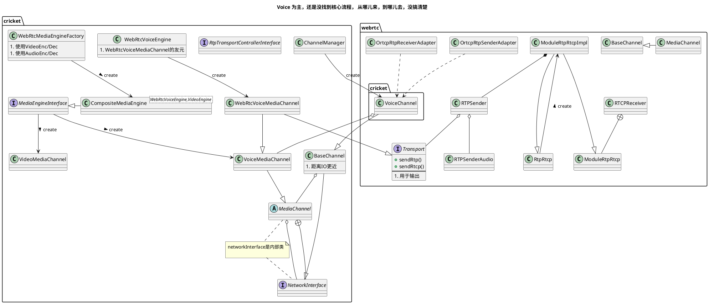
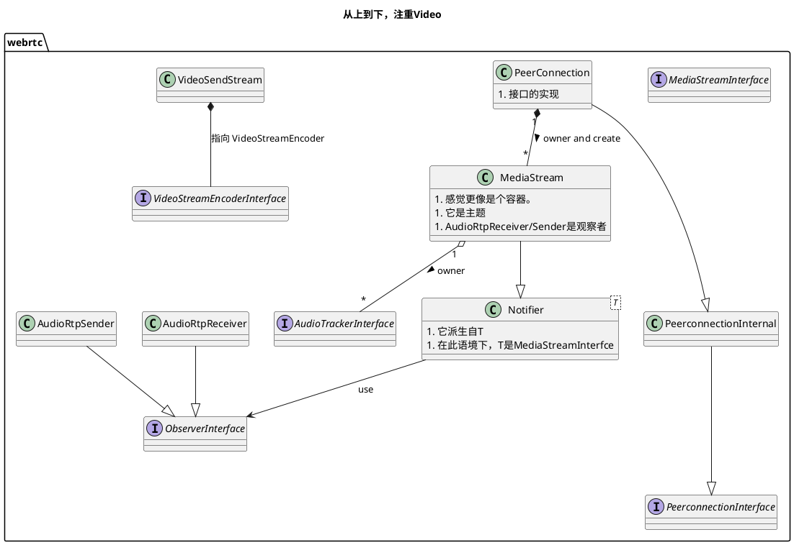
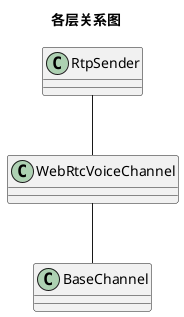

# 组件关系

```plantuml
@startuml
title  Voice 为主，还是没找到核心流程， 从哪儿来，到哪儿去，没搞清楚 
namespace webrtc {
    class RTPSender {

    }
    Interface Transport {
        + sendRtp()
        + sendRtcp()
        ==
        1. 用于输出
    }
    class OrtcpRtpSenderAdapter {}
    class OrtcpRtpReceiverAdapter {}
    RtpRtcp --> ModuleRtpRtcpImpl : create >
    RTCPReceiver +-- ModuleRtpRtcp 
    ModuleRtpRtcpImpl ---|> RtpRtcp
    ModuleRtpRtcpImpl ---|> ModuleRtpRtcp
    ModuleRtpRtcpImpl *-- RTPSender
    RTPSender o-- Transport
    RTPSender o-- RTPSenderAudio
    BaseChannel <|- MediaChannel
    OrtcpRtpSenderAdapter ..> cricket.VoiceChannel
    OrtcpRtpReceiverAdapter ..> cricket.VoiceChannel

}
namespace cricket {
    class BaseChannel {
        1. 距离IO更近
    }
    class MediaChannel {}
    class WebRtcMediaEngineFactory {
        1. 使用VideoEnc/Dec
        1. 使用AudioEnc/Dec
    } 
    interface MediaEngineInterface {
    }
    Abstract MediaChannel {}
    interface NetworkInterface {}
    interface RtpTransportControllerInterface
    class CompositeMediaEngine <WebRtcVoiceEngine,VideoEngine >{ 
    } 
    class WebRtcVoiceEngine {
        1. WebRtcVoiceMediaChannel的友元
    }

    MediaChannel o-- NetworkInterface
    NetworkInterface --+ MediaChannel 
    note "networkInterface是内部类\n" as N1
    MediaChannel .. N1
    N1 .. NetworkInterface

    ChannelManager --> VoiceChannel : create 
    BaseChannel --|> NetworkInterface
    BaseChannel o-- MediaChannel
    VoiceChannel --|> BaseChannel
    VoiceChannel o--VoiceMediaChannel
    WebRtcMediaEngineFactory -->CompositeMediaEngine : create >
    CompositeMediaEngine -|> MediaEngineInterface
    MediaEngineInterface --> VideoMediaChannel : create >
    MediaEngineInterface --> VoiceMediaChannel : create >
    WebRtcVoiceEngine --> WebRtcVoiceMediaChannel : create
    WebRtcVoiceMediaChannel --|> VoiceMediaChannel
    VoiceMediaChannel --|> MediaChannel
    WebRtcVoiceMediaChannel --|> webrtc.Transport
}
@enduml
```

```plantuml
@startuml
title "从上到下，注重Video"
namespace webrtc {
    interface ObserverInterface
    interface MediaStreamInterface
    interface AudioTrackerInterface
    interface PeerconnectionInterface
    interface VideoStreamEncoderInterface
    class PeerConnection {
        1. 接口的实现
    }
    class Notifier < T > {
        1. 它派生自T 
        1. 在此语境下，T是MediaStreamInterfce 
    }
    class MediaStream {
        1. 感觉更像是个容器。
        1. 它是主题
        1. AudioRtpReceiver/Sender是观察者
    }

    VideoSendStream *-- VideoStreamEncoderInterface : 指向 VideoStreamEncoder
    AudioRtpReceiver --|> ObserverInterface
    AudioRtpSender --|> ObserverInterface
    PeerConnection "1" *-- "*" MediaStream : owner and create >
    MediaStream --|> Notifier
    Notifier --> ObserverInterface : use
    MediaStream "1" o-- "*" AudioTrackerInterface : owner >
    PeerconnectionInternal ---|> PeerconnectionInterface
    PeerConnection ---|> PeerconnectionInternal
}

@enduml
```

```plantuml
@startuml
title 各层关系图 
RtpSender -- WebRtcVoiceChannel 
WebRtcVoiceChannel -- BaseChannel
@enduml
```