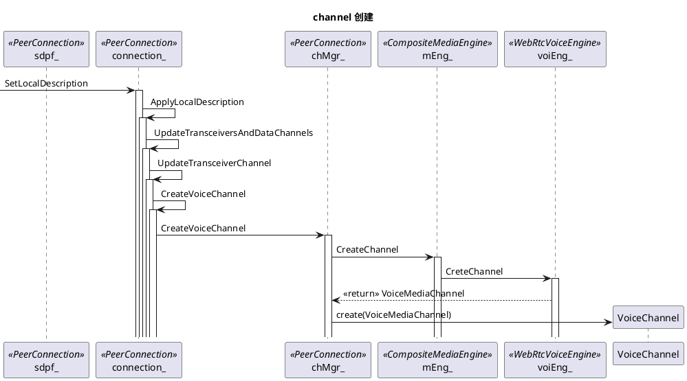

```plantuml
@startuml
title channel 创建 
participant sdpf_ as sdpf <<PeerConnection>>
participant connection_ as pc <<PeerConnection>>
participant chMgr_ as chmgr <<PeerConnection>>
participant mEng_ as meng <<CompositeMediaEngine>>
participant voiEng_ as voieng <<WebRtcVoiceEngine>>

-> pc : SetLocalDescription
activate pc
pc -> pc : ApplyLocalDescription
activate pc
pc -> pc : UpdateTransceiversAndDataChannels
activate pc
pc -> pc : UpdateTransceiverChannel
activate pc
pc -> pc : CreateVoiceChannel
activate pc
pc -> chmgr : CreateVoiceChannel
activate chmgr
chmgr -> meng : CreateChannel
activate meng
meng -> voieng : CreteChannel
activate voieng
voieng --> chmgr : <<return>> VoiceMediaChannel
create VoiceChannel
chmgr -> VoiceChannel : create(VoiceMediaChannel)
@enduml
```