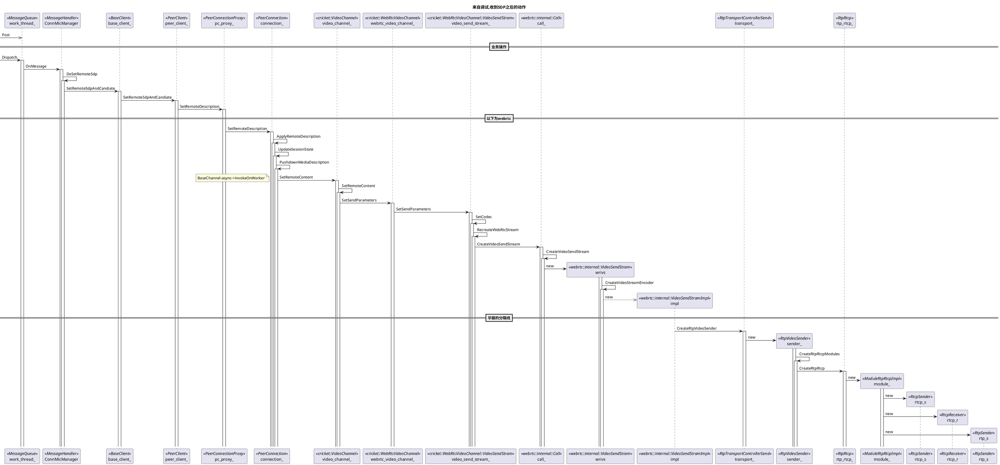
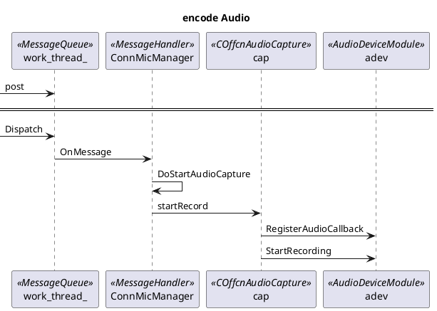
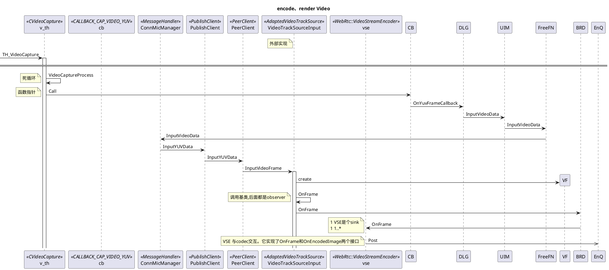
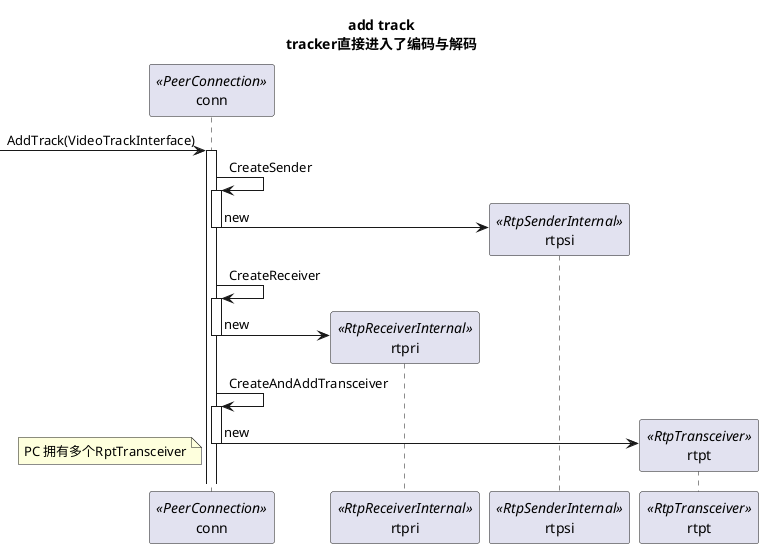
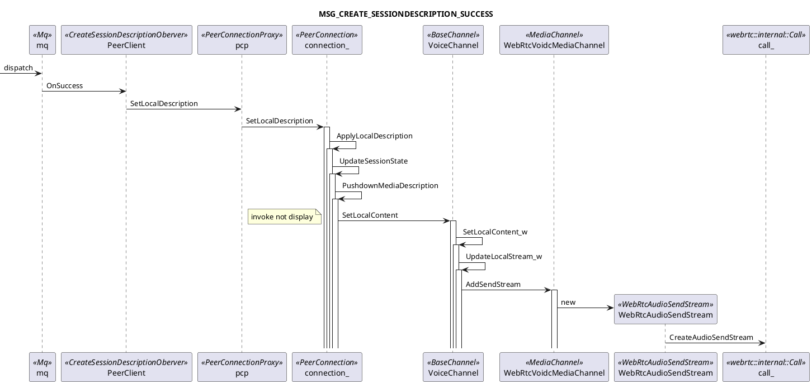
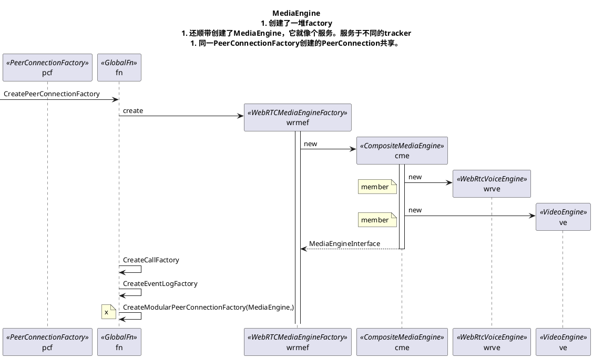
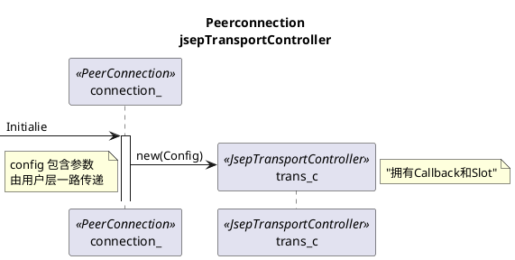

```plantuml
participant brd as BRD <<VideoBroadcaster>>
participant sink as SINK <<CVideoRenderEx>>
SINK -> PCli : OnVideoFrame 
PCli -> BC : OnChannelVideoFrame
BC -> UIM : OnChannelVideoFrame
activate UIM
UIM -> UIM : WriteLocalBuffer
UIM ->> UIM : PostMessage
==怎么编码并发送的？==
```



